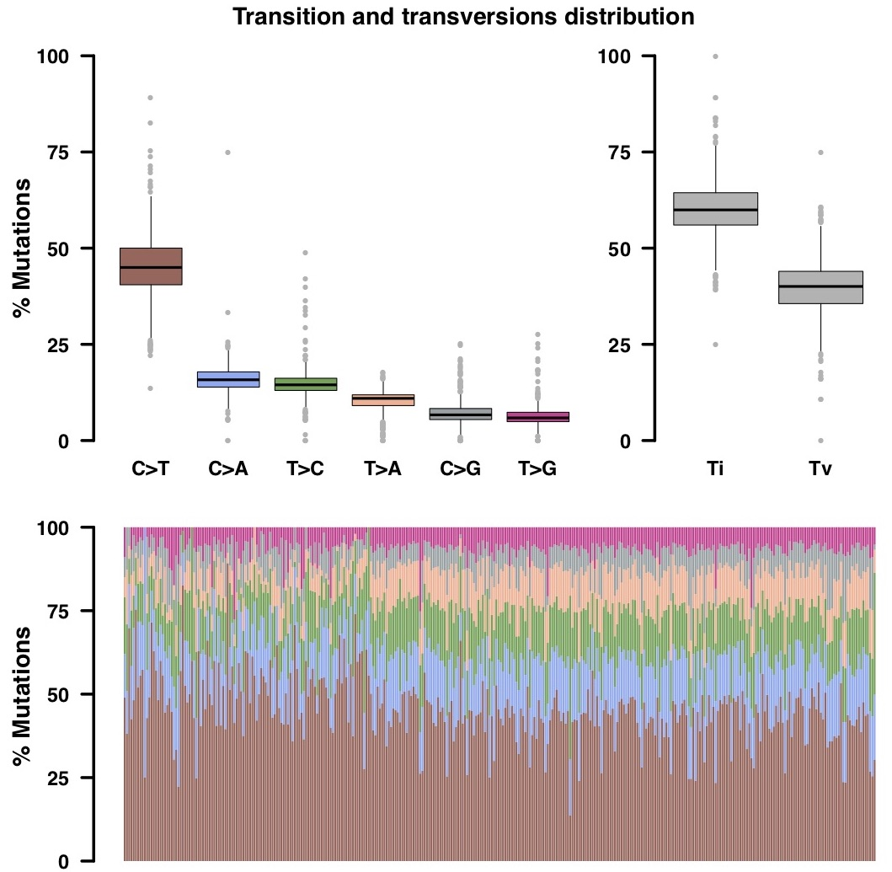

## ICGC PACA-CA cohort MAF summary

Example of *[summariseMAFs.R](https://github.com/umccr/MAF-summary/tree/master/summariseMAFs.R)* output files for ICGC PACA-CA (  ) cohort.

## Table of contents

<!-- vim-markdown-toc GFM -->
* [Plots](#plots)
  * [MAF summary plot](#maf-summary-plot)
  * [Oncoplot](#oncoplot)
  * [Transition and transversions distribution plot](#transition-and-transversions-distribution-plot)
  * [Comparison with TCGA cohorts](#comparison-with-tcga-cohorts)
* [Tables](#tables)
  * [MAF summary](#maf-summary)
  * [Sample summary](#sample-summary)
  * [Gene summary](#gene-summary)
  * [MAF fields](#maf-fields-table)
  * [Transitions and transversions summary](#transitions_and_transversionse-summary)
    * [Fraction tab](#fraction-tab)
    * [Count tab](#count-tab)
    * [TiTv tab](#titv-tab)

<!-- vim-markdown-toc -->
 

## Plots

### MAF summary plot

 

>A summary for MAF file displaying frequency of various mutation types/classes (top panel), the number of variants in each sample as a stacked bar-plot (bottom-left) and variant types as a box-plot (bottom-middle), as well as the frequency of different mutation types for the top 10 mutated genes (bottom-right). The horizontal dashed line in stacked bar-plot represents median number of variants across the cohort.

 

---
### Oncoplot

 

>Oncoplot illustrating illustrating different types of mutations observed across samples for the 10 most frequently mutated genes. The side and top bar-plots present the frequency of mutations in each gene and in each sample, respectively.

 

---
### Transition and transversions distribution plot

 

> Plots presenting the transition and transversions distribution. The box-plots (top panel) show the overall distribution of the six different conversions (left), and the transition and transversions frequency (right). The stacked bar-plot displays the fraction of the six different conversions in each sample.

 

---
### Comparison with TCGA cohorts

 

>Plot illustrating the mutation load in ICGC PACA-CA cohort along distribution of variants compiled from over 10,000 WXS samples across 33 TCGA landmark cohorts. Every dot represents a sample whereas the red horizontal lines are the median numbers of mutations in the respective cancer types. The vertical axis (log scaled) shows the number of mutations per megabase whereas the different cancer types are ordered on the horizontal axis based on their median numbers of somatic mutations. This plot is similar to the one described in the paper [Signatures of mutational processes in human cancer](https://www.ncbi.nlm.nih.gov/pubmed/23945592) by Alexandrov *et al*.

 

## Tables

### MAF summary

[MAF_summary.xlsx](https://github.com/umccr/MAF-summary/tree/master/ICGC_PACA-CA_MAF_summary/MAF_summary.xlsx) - tab ***ICGC-PACA-CA***

>Excel spreadsheet tab with basic information about  MAF file, including NCBI build, no. fo samples and genes, no. of different mutation types ( frameshift deletions, frameshift insertions, in-frame deletions, in-frame insertions, missense mutations, nonsense mutations, nonstop mutations, splice site mutations, translation start site mutations) as well as the total no. of mutations present in the MAF file.

 

---
### Sample summary

[MAF_sample_summary.xlsx](https://github.com/umccr/MAF-summary/tree/master/ICGC_PACA-CA_MAF_summary/MAF_sample_summary.xlsx) - tab ***ICGC-PACA-CA***

>Excel spreadsheet tab with per-sample information (rows) about no. of different types of mutations (columns), including frameshift deletions, frameshift insertions, in-frame deletions, in-frame insertions, missense mutations, nonsense mutations, nonstop mutations, splice site mutations, translation start site mutations, as well as the total no. of mutations present in the MAF file.

 

---
### Gene summary

[MAF_gene_summary.xlsx](https://github.com/umccr/MAF-summary/tree/master/ICGC_PACA-CA_MAF_summary/MAF_gene_summary.xlsx) - tab ***ICGC-PACA-CA***

>Excel spreadsheet tab with per-gene information (rows) about no. of different types of mutations (columns), including frameshift deletions, frameshift insertions, in-frame deletions, in-frame insertions, missense mutations, nonsense mutations, nonstop mutations, splice site mutations, translation start site mutations, as well as the total no. of mutations present in the MAF file. The last two columns contain the no. of samples with mutations/alterations in the corresponding gene.

 

---
### MAF fields

[MAF_fields.xlsx](https://github.com/umccr/MAF-summary/tree/master/ICGC_PACA-CA_MAF_summary/MAF_fields.xlsx) - tab ***ICGC-PACA-CA***

>Excel spreadsheet tab listing all fields (columns) in the MAF file.

 

---
### Transitions and transversions summary

* [MAF_summary_titv.xlsx](https://github.com/umccr/MAF-summary/tree/master/ICGC_PACA-CA_MAF_summary/MAF_summary_titv.xlsx) - tab ***ICGC-PACA-CA (fraction)***

>Excel spreadsheet tab containing information about the fraction of each of the six different conversions (transitions and transversions) in each sample.
