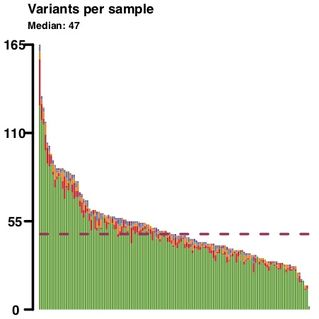

## TCGA PAAD cohort MAF summary

Example of *[summariseMAFs.R](https://github.com/umccr/MAF-summary/tree/master/summariseMAFs.R)* output files for TCGA PAAD (  ) cohort. This example shows one sample with extremely high mutation burden. The *[summariseMAFs.R](https://github.com/umccr/MAF-summary/tree/master/summariseMAFs.R)* script was re-ran after removing the problematic sample and the outputs were compared.

#### MAF summary plots for all samples

 

 &nbsp;&nbsp;&nbsp; 

  

####  ...and after removing problematic sample

 &nbsp;&nbsp;&nbsp; 

>The variants per sample plot and oncoplot within the *[MAF_summary_TCGA-PAAD.pdf](https://github.com/umccr/MAF-summary/tree/master/TCGA_PAAD_MAF_summary/MAF_summary_TCGA-PAAD.pdf)* file indicates that one sample has extremely high mutation burden compared to other samples within this cohort (the stacked bar-plots in the top panel). The *TCGA-PAAD* tab in the [MAF_sample_summary.xlsx](https://github.com/umccr/MAF-summary/blob/master/TCGA_PAAD_MAF_summary/MAF_sample_summary.xlsx) spreadsheet shows that sample ***TCGA-IB-7651-01A-11D-2154-08*** has 14,776 variants, which is ~100 times more than the second most mutated patient in that cohort. After removing this sample from the MAF file the variants distribution is more uniform across remaining samples (bottom panel).
 \* For plots description see [MAF summary plot](https://github.com/umccr/MAF-summary/tree/master/ICGC_PACA-CA_MAF_summary#maf-summary-plot) and [Oncoplot](https://github.com/umccr/MAF-summary/tree/master/ICGC_PACA-CA_MAF_summary#oncoplot) sections.

 

#### MAF summary table for all samples and after removing problematic sample

Variant type | All samples   [MAF_sample_summary.xlsx](https://github.com/umccr/MAF-summary/tree/master/TCGA_PAAD_MAF_summary/MAF_sample_summary.xlsx)  | Problematic sample excluded   [MAF_summary_TCGA-PAAD_clean.xlsx](https://github.com/umccr/MAF-summary/tree/master/TCGA_PAAD_MAF_summary/MAF_summary_TCGA-PAAD_clean.xlsx)
------------ | ------------ | ------------
Frame_Shift_Del | 123 | 120
Frame_Shift_Ins | 51 | 48
In_Frame_Del | 34 | 34
In_Frame_Ins | 4 | 4
Missense_Mutation | ***19,610*** | 6,418
Nonsense_Mutation | ***1,284*** | 434
Nonstop_Mutation | 6 | 3
Splice_Site | ***963*** | 276
Translation_Start_Site | 50 | 12
**Total** | **22,125** | **7,349**
 

 

 
