## Summarising and visualising multiple MAF files

Script summarising and visualising multiple [MAF](https://software.broadinstitute.org/software/igv/MutationAnnotationFormat) files. It produces ***summariseMAFs.html*** report and *[summariseMAFs.md](https://github.com/umccr/MAF-summary/tree/master/scripts/summariseMAFs.md)* markdown report.

<br>

Make sure to set the java max heap size to 2Gb to accomodate big gene tables written into excel spreadsheet using the xlsx R package

```r
##### Set the jave max heap size to 2Gb to accomodate big gene tables
options( java.parameters = "-Xmx2000m" )
```

<br>

### Load libraries

```r
suppressMessages(library(knitr))
suppressMessages(library(maftools))
suppressMessages(library(xlsx))
suppressMessages(library(optparse))
```

<br>

### Read MAF files

Go to the MAF files directory, read the files and create directory for output files, if does not exist already

```r
##### Configure knitr and set up working directory to directory with MAF files
knitr::opts_knit$set(root.dir = params$mafDir)
```

```r
##### Read MAF files and put associated info into a list
mafFiles <- gsub("\\s","", params$mafFiles)
mafFiles <-  unlist(strsplit(mafFiles, split=',', fixed=TRUE))
mafFiles <- paste(params$mafDir, mafFiles, sep="/")

mafInfo <- vector("list", length(mafFiles))

for ( i in 1:length(mafFiles) ) {
  mafInfo[[i]] = read.maf(maf = mafFiles[i], verbose = FALSE)
```

```r
##### Create directory for output files
outDir <- paste(params$mafDir, params$outDir, sep = "/")
  
if ( !file.exists(params$outDir) ){
  dir.create(outDir)
  cat(paste("\nOutput files will be saved in \"", outDir, "\" folder\n\n", sep=""))
} else {
  cat(paste("\nDirectory \"", outDir, "\" already exists! The output files will be saved there.\n\n", sep=""))
}
```

<br>

### Summarise MAF files

Generate an excel spreadsheet  with basic information about each MAF file, including NCBI build, no. fo samples and genes, no. of different mutation types ( frameshift deletions, frameshift insertions, in-frame deletions, in-frame insertions, missense mutations, nonsense mutations, nonstop mutations, splice site mutations, translation start site mutations), as well as the total no. of mutations present in the MAF file. Individual tabs present summary for corresponding datasets.

```r
cohorts.list <- gsub("\\s","", params$cohorts)
cohorts.list <- unlist(strsplit(cohorts.list, split=',', fixed=TRUE))

##### Write overall summary into a file
if ( !file.exists(paste(outDir, "MAF_summary.xlsx", sep = "/")) ){
  for ( i in 1:length(mafFiles) ) {
    write.xlsx(mafInfo[[i]]@summary, file=paste(outDir, "MAF_summary.xlsx", sep="/"), sheetName=cohorts.list[i], row.names=FALSE,  append=TRUE)
  }
} else {
  cat(paste("\nFile \"MAF_summary.xlsx\" already exists in", outDir, "!\n\n", sep=" "))
}
```

<br>

#### Samples summary

Create a separate excel file with samples summary. Each tab contains per-sample information (rows) about no. of different types of mutations (columns), including frameshift deletions, frameshift insertions, in-frame deletions, in-frame insertions, missense mutations, nonsense mutations, nonstop mutations, splice site mutations, translation start site mutations, as well as the total no. of mutations present in the MAF file.

```r
##### Write samples summary into a file
if ( !file.exists(paste(outDir, "MAF_sample_summary.xlsx", sep = "/")) ) {
  
  for ( i in 1:length(mafFiles) ) {
    write.xlsx(maftools::getSampleSummary(mafInfo[[i]]), file=paste(outDir, "MAF_sample_summary.xlsx", sep="/"), sheetName=cohorts.list[i], row.names=FALSE,  append=TRUE)
  }
} else {
  cat(paste("\nFile \"MAF_sample_summary.xlsx\" already exists in", outDir, "!\n\n", sep=" "))
}
```

<br>

#### Genes summary

Now write gene summary into a file. This part creates an excel spreadsheet coontaining tabs for individual cohorts with per-gene information (rows) about no. of different types of mutations (columns), including frameshift deletions, frameshift insertions, in-frame deletions, in-frame insertions, missense mutations, nonsense mutations, nonstop mutations, splice site mutations, translation start site mutations, as well as the total no. of mutations present in the MAF file. The last two columns contain the no. of samples with mutations/alterations in the corresponding gene.

```r
##### Write gene summary into a file
if ( !file.exists(paste(outDir, "MAF_gene_summary.xlsx", sep = "/")) ){
  for ( i in 1:length(mafFiles) ) {
    write.xlsx(maftools::getGeneSummary(mafInfo[[i]]), file=paste(outDir, "MAF_gene_summary.xlsx", sep="/"), sheetName=cohorts.list[i], row.names=FALSE,  append=TRUE)
  }
} else {
  cat(paste("\nFile \"MAF_gene_summary.xlsx\" already exists in", outDir, "!\n\n", sep=" "))
}
```

<br>

#### MAF fields

Finally, create an excel spreadsheet listing all fields (columns) in the individaul MAF files.

```r
##### Get all fields in MAF files
if ( !file.exists(paste(outDir, "MAF_fields.xlsx", sep = "/")) ){
  for ( i in 1:length(mafFiles) ) {
    write.xlsx(maftools::getFields(mafInfo[[i]]), file=paste(outDir, "MAF_fields.xlsx", sep="/"), sheetName=cohorts.list[i], row.names=FALSE,  append=TRUE, col.names=FALSE)
  }
} else {
  cat(paste("\nFile \"MAF_fields.xlsx\" already exists in", outDir, "!\n\n", sep=" "))
}
```

<br>

### Visualisation

This part creates a set of plots summarising individual MAF files.

#### MAF summary plot

A summary for MAF file displaying frequency of various mutation/SNV types/classes (top panel), the number of variants in each sample as a stacked bar-plot (bottom-left) and variant types as a box-plot (bottom-middle), as well as the frequency of different mutation types for the top 10 mutated genes (bottom-right). The horizontal dashed line in stacked bar-plot represents median number of variants across the cohort.

```r
###### Generate separate plot for each cohort
for ( i in 1:length(mafFiles) ) {

  cat(paste("\nGenerating MAF summary plot for", cohorts.list[i], "cohort...\n\n", sep=" "))

  ##### Plotting MAF summary
  par(mar=c(4,4,2,0.5), oma=c(1.5,2,2,1))
  maftools::plotmafSummary(maf = mafInfo[[i]], rmOutlier = TRUE, addStat = 'median', dashboard = TRUE, titvRaw = FALSE)
  mtext("MAF summary", outer=TRUE,  cex=1, line=-0.5)
}
```

```
## Generating MAF summary plot for TCGA-PAAD cohort...
```

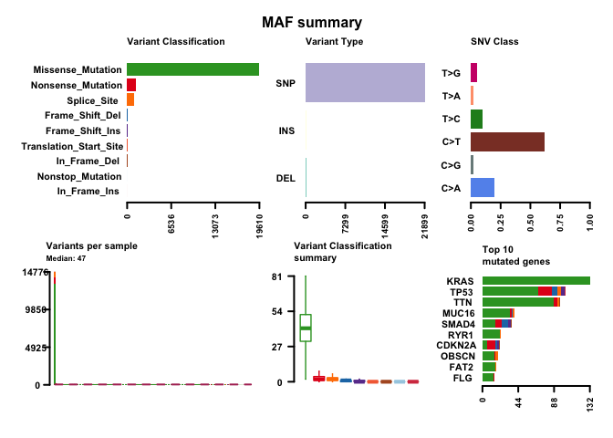<!-- -->

```
## Generating MAF summary plot for ICGC-PACA-AU cohort...
```

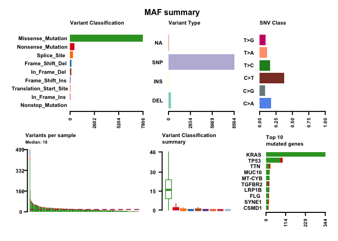<!-- -->

```
## Generating MAF summary plot for ICGC-PACA-AU-additional cohort...
```

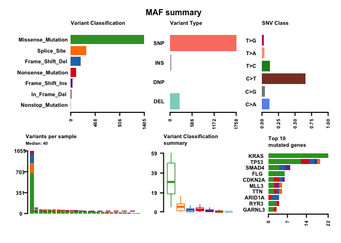<!-- -->

```
## Generating MAF summary plot for ICGC-PACA-CA cohort...
```

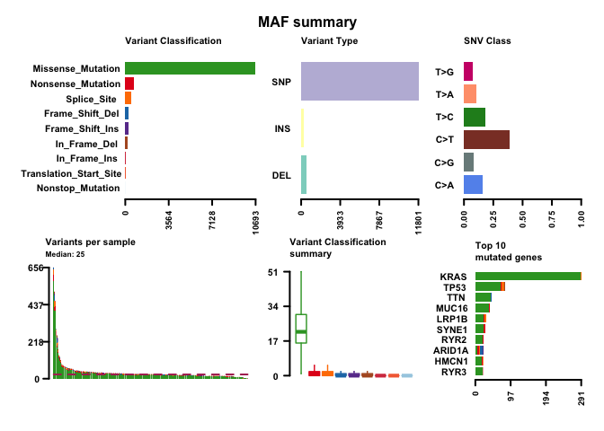<!-- -->

<br>

#### Oncoplot

Oncoplot illustrating different types of mutations observed across samples for the 10 most frequently mutated genes. The side and top bar-plots present the frequency of mutations in each gene and in each sample, respectively.

```r
###### Generate separate plot for each cohort
for ( i in 1:length(mafFiles) ) {

  cat(paste("\nGenerating oncoplot for", cohorts.list[i], "cohort...\n\n", sep=" "))

  ##### Drawing oncoplots for the top 10 genes in each cohort
  plot.new()
  par(mar=c(4,4,2,0.5), oma=c(1.5,2,2,1))
  maftools::oncoplot(maf = mafInfo[[i]], top = 10, fontSize = 12)
}
```

```
## Generating oncoplot for TCGA-PAAD cohort...
```

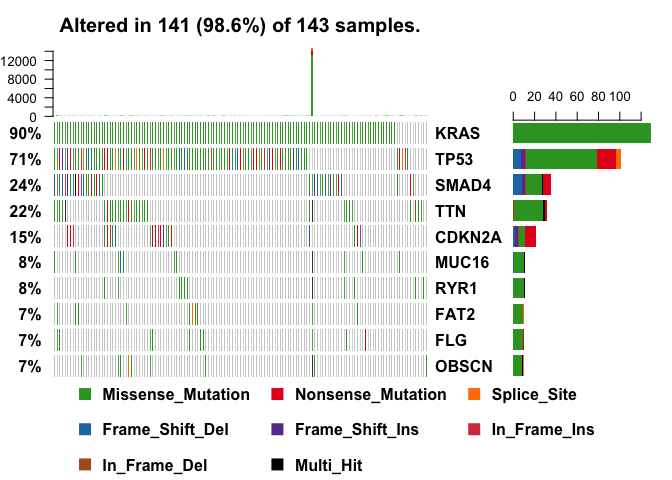<!-- -->

```
## Generating oncoplot for ICGC-PACA-AU cohort...
```

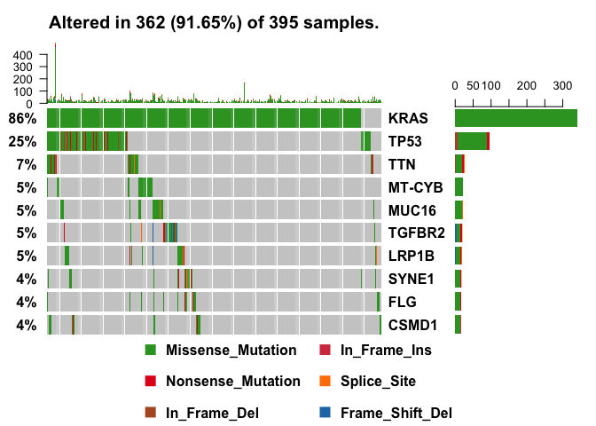<!-- -->

```
## Generating oncoplot for ICGC-PACA-AU-additional cohort...
```

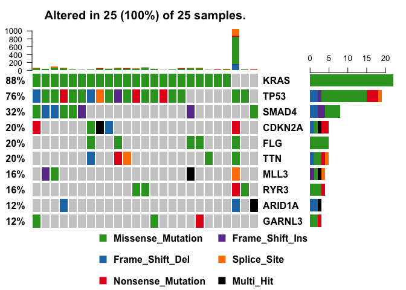<!-- -->

```
## Generating oncoplot for ICGC-PACA-CA cohort...
```

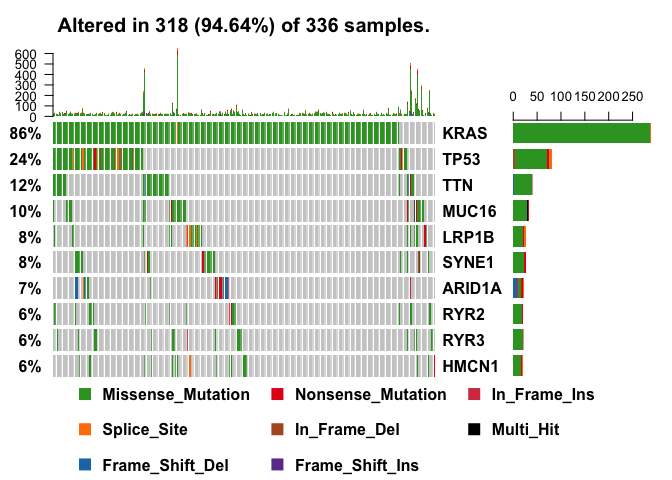<!-- -->

<br>

#### Transition and transversions distribution plot

Plots presenting the transition and transversions distribution. The box-plots (top panel) show the overall distribution of the six different conversions (C>A, C>G, C>T, T>C, T>A and T>G)(left), and the transition and transversions frequency (right). The stacked bar-plot (bottom) displays the fraction of the six different conversions in each sample.

```r
###### Generate separate plot for each cohort
for ( i in 1:length(mafFiles) ) {

  cat(paste("\nGenerating TiTv plot for", cohorts.list[i], "cohort...\n\n", sep=" "))

  ##### Drawing distribution plots of the transitions and transversions
  titv.info <- maftools::titv(maf = mafInfo[[i]], plot = FALSE, useSyn = TRUE)

  maftools::plotTiTv(res = titv.info)
  mtext("Transition and transversions distribution", outer=TRUE,  cex=1, line=-1.5)
}
```

```
## Generating TiTv plot for TCGA-PAAD cohort...
```

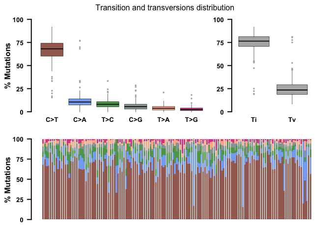<!-- -->

```
## Generating TiTv plot for ICGC-PACA-AU cohort...
```

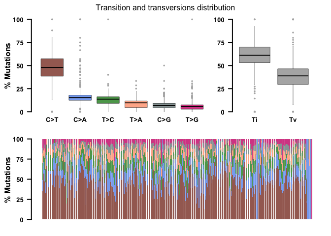<!-- -->

```
## Generating TiTv plot for ICGC-PACA-AU-additional cohort...
```

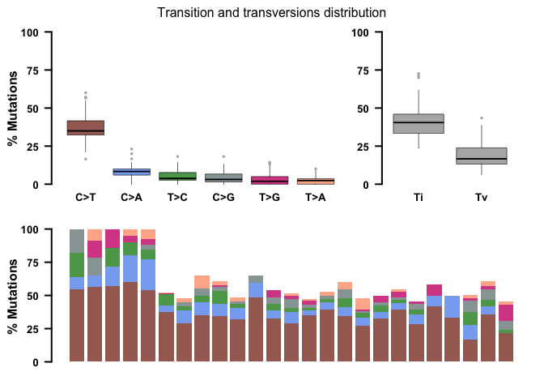<!-- -->

```
## Generating TiTv plot for ICGC-PACA-CA cohort...
```

<!-- -->

<br>


#### Comparison with TCGA cohorts

Plot illustrating the mutation load in ICGC PACA-CA cohort along distribution of variants compiled from over 10,000 WXS samples across 33 TCGA landmark cohorts. Every dot represents a sample whereas the red horizontal lines are the median numbers of mutations in the respective cancer types. The vertical axis (log scaled) shows the number of mutations per megabase whereas the different cancer types are ordered on the horizontal axis based on their median numbers of somatic mutations. This plot is similar to the one described in the paper "Signatures of mutational processes in human cancer" by Alexandrov et al. (PMID: 23945592)

```r
###### Generate separate plot for each cohort
for ( i in 1:length(mafFiles) ) {

  ##### Compare mutation load against TCGA cohorts
  maftools::tcgaCompare(maf = mafInfo[[i]], cohortName = cohorts.list[i], primarySite=TRUE)
}
```

```
##                      Cohort Cohort_Size Median_Mutations
##  1:                    Skin         468            315.0
##  2:           Lung Squamous         494            187.5
##  3:              Lung Adeno         567            158.0
## ...
## 12:                   Liver         374             67.0
## 13:                  Cervix         305             66.0
## 14:       Colorectal Rectum         158             63.0
## 15:         Kidney Papilary         288             53.0
## 16:               TCGA-PAAD         143             47.0
## 17:       Kidney Clear Cell         339             44.0
## 18:                  Uterus          57             35.0
## ...
## 34:           Adrenal Gland         177              7.0
##                      Cohort Cohort_Size Median_Mutations
```

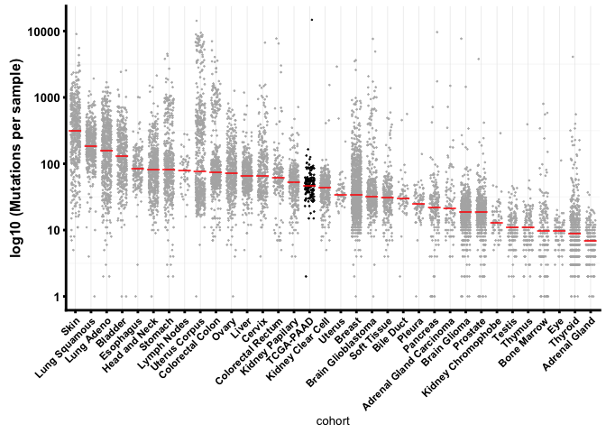<!-- -->

```
##                      Cohort Cohort_Size Median_Mutations
##  1:                    Skin         468            315.0
##  2:           Lung Squamous         494            187.5
## ...
## 22:                  Pleura          83             25.0
## 23:                Pancreas         178             22.5
## 24: Adrenal Gland Carcinoma          92             21.5
## 25:            Brain Glioma         511             19.0
## 26:                Prostate         496             19.0
## 27:            ICGC-PACA-AU         395             18.0
## 28:      Kidney Chromophobe          66             13.0
## 29:                  Testis         149             11.0
## ...
## 34:           Adrenal Gland         177              7.0
##                      Cohort Cohort_Size Median_Mutations
```

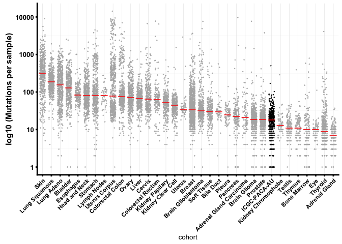<!-- -->

```
##                      Cohort Cohort_Size Median_Mutations
##  1:                    Skin         468            315.0
##  2:           Lung Squamous         494            187.5
## ...
## 14:       Colorectal Rectum         158             63.0
## 15:         Kidney Papilary         288             53.0
## 16:       Kidney Clear Cell         339             44.0
## 17: ICGC-PACA-AU-additional          25             40.0
## 18:                  Uterus          57             35.0
## 19:                  Breast        1044             34.0
## 20:      Brain Glioblastoma         395             32.0
## ...
## 33:                 Thyroid         491              9.0
## 34:           Adrenal Gland         177              7.0
##                      Cohort Cohort_Size Median_Mutations
```

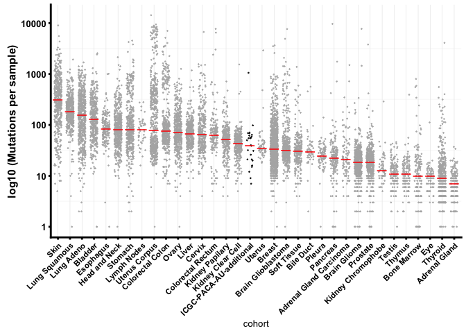<!-- -->

```
##                      Cohort Cohort_Size Median_Mutations
##  1:                    Skin         468            315.0
##  2:           Lung Squamous         494            187.5
## ...
## 16:       Kidney Clear Cell         339             44.0
## 17:                  Uterus          57             35.0
## 18:                  Breast        1044             34.0
## 19:      Brain Glioblastoma         395             32.0
## 20:             Soft Tissue         255             31.0
## 21:               Bile Duct          51             30.0
## 22:                  Pleura          83             25.0
## 23:            ICGC-PACA-CA         336             25.0
## 24:                Pancreas         178             22.5
## ...
## 34:           Adrenal Gland         177              7.0
##                      Cohort Cohort_Size Median_Mutations
```

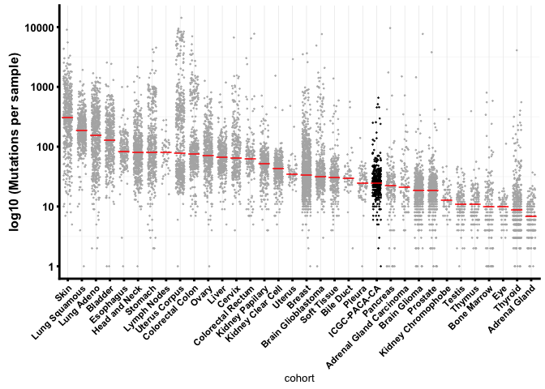<!-- -->

<br>

Print session info


```r
sessionInfo()
```

```
## R version 3.5.0 (2018-04-23)
## Platform: x86_64-apple-darwin15.6.0 (64-bit)
## Running under: macOS High Sierra 10.13.4
## 
## Matrix products: default
## BLAS: /Library/Frameworks/R.framework/Versions/3.5/Resources/lib/libRblas.0.dylib
## LAPACK: /Library/Frameworks/R.framework/Versions/3.5/Resources/lib/libRlapack.dylib
## 
## locale:
## [1] en_AU.UTF-8/en_AU.UTF-8/en_AU.UTF-8/C/en_AU.UTF-8/en_AU.UTF-8
## 
## attached base packages:
## [1] parallel  stats     graphics  grDevices utils     datasets  methods  
## [8] base     
## 
## other attached packages:
## [1] knitr_1.20          optparse_1.4.4      xlsx_0.5.7         
## [4] xlsxjars_0.6.1      rJava_0.9-9         maftools_1.6.07    
## [7] Biobase_2.40.0      BiocGenerics_0.26.0
```
