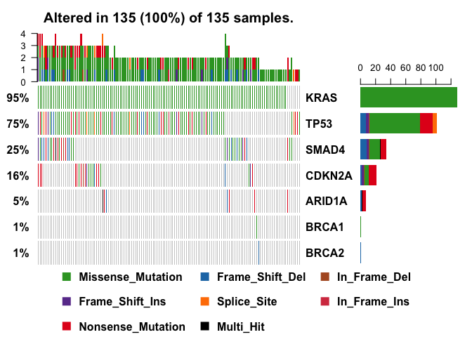
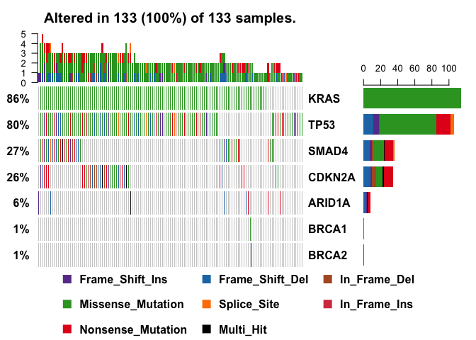
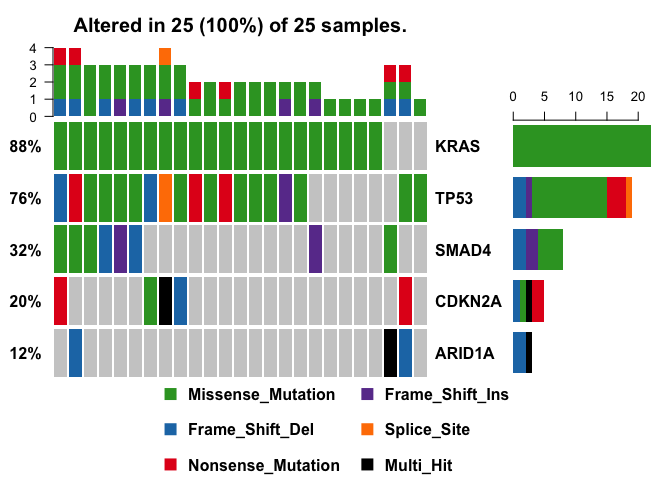
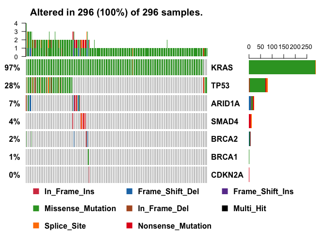
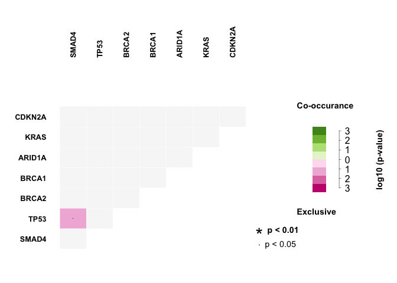
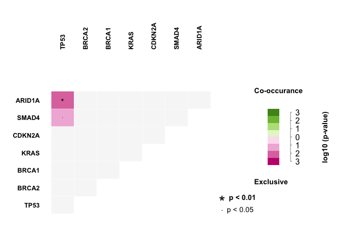
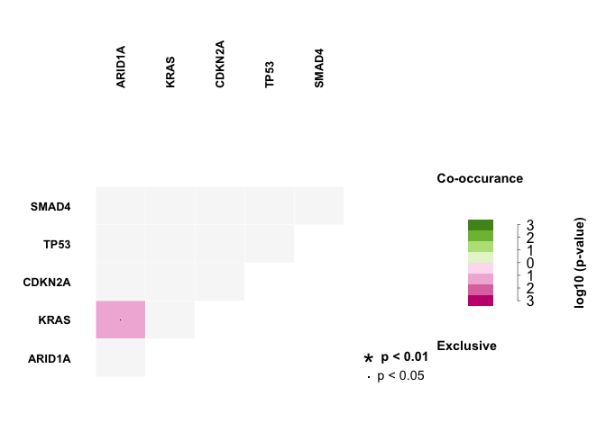

Script to summarise and visualise information for user-defined genes from multiple [Mutation Annotation Format](https://software.broadinstitute.org/software/igv/MutationAnnotationFormat) (MAF) files using *[maftools](https://www.bioconductor.org/packages/devel/bioc/vignettes/maftools/inst/doc/maftools.html)* R package.

Make sure to set the java max heap size to 2Gb to accomodate big gene tables written into excel spreadsheet using the xlsx R package


```r
##### Set the jave max heap size to 2Gb to accomodate big gene tables
options( java.parameters = "-Xmx2000m" )
```

### Load libraries


```r
suppressMessages(library(knitr))
suppressMessages(library(maftools))
suppressMessages(library(xlsx))
suppressMessages(library(optparse))
suppressMessages(library(DT))
```

## Read MAF files

Go to the MAF files directory, read the files and create directory for output files, if does not exist already


```r
##### Read MAF files and put associated info into a list
mafFiles <- params$mafFiles
mafInfo <- vector("list", length(mafFiles))

for ( i in 1:length(mafFiles) ) {
  mafInfo[[i]] = read.maf(maf = mafFiles[i], verbose = FALSE)
  
  ##### Subsets MAF based on queried genes
  mafInfo[[i]]  <- subsetMaf(maf=mafInfo[[i]], genes=params$genes, mafObj=TRUE)
}
```

```
## [1] NA
## [1] NA
## [1] NA
## [1] NA
```

```r
##### Create directory for output files
outDir <- paste(params$mafDir, params$outDir, sep = "/")

if ( !file.exists(params$outDir) ){
  dir.create(outDir)
}
```

## Genes summary {.tabset}

### Tables

Create tables for individual cohorts with information for queried genes (rows), including information about no. of different types of mutations (columns), including frameshift deletions, frameshift insertions, in-frame deletions, in-frame insertions, missense mutations, nonsense mutations, nonstop mutations, splice site mutations, translation start site mutations, as well as the total no. of mutations present in the MAF file. The last two columns contain the no. of samples with mutations/alterations in the corresponding gene.


```r
##### Write gene summary into a file
cohorts.list <- params$cohorts

if ( !file.exists(paste(outDir, "MAF_gene_summary.xlsx", sep = "/")) ){
  for ( i in 1:length(mafFiles) ) {
    write.xlsx(maftools::getGeneSummary(mafInfo[[i]]), file=paste(outDir, "MAF_gene_summary.xlsx", sep="/"), sheetName=cohorts.list[i], row.names=FALSE,  append=TRUE)
  }
}

##### Present a gene table in the html report
##### Create a list for htmlwidgets
widges.list <- htmltools::tagList()

for ( i in 1:length(mafFiles) ) {
  widges.list[[i]] <- DT::datatable(data = maftools::getGeneSummary(mafInfo[[i]]), caption = paste0("Genes summary: ", cohorts.list[i]), filter = "top")
}

##### Print a list of htmlwidgets
widges.list
```

<!--html_preserve--><div id="htmlwidget-6ff3e7ccb8a292386319" style="width:960px;height:500px;" class="datatables html-widget"></div>
<script type="application/json" data-for="htmlwidget-6ff3e7ccb8a292386319">{"x":{"filter":"top","filterHTML":"<tr>\n  <td><\/td>\n  <td data-type=\"character\" style=\"vertical-align: top;\">\n    <div class=\"form-group has-feedback\" style=\"margin-bottom: auto;\">\n      <input type=\"search\" placeholder=\"All\" class=\"form-control\" style=\"width: 100%;\"/>\n      <span class=\"glyphicon glyphicon-remove-circle form-control-feedback\"><\/span>\n    <\/div>\n  <\/td>\n  <td data-type=\"integer\" style=\"vertical-align: top;\">\n    <div class=\"form-group has-feedback\" style=\"margin-bottom: auto;\">\n      <input type=\"search\" placeholder=\"All\" class=\"form-control\" style=\"width: 100%;\"/>\n      <span class=\"glyphicon glyphicon-remove-circle form-control-feedback\"><\/span>\n    <\/div>\n    <div style=\"display: none; position: absolute; width: 200px;\">\n      <div data-min=\"0\" data-max=\"8\"><\/div>\n      <span style=\"float: left;\"><\/span>\n      <span style=\"float: right;\"><\/span>\n    <\/div>\n  <\/td>\n  <td data-type=\"integer\" style=\"vertical-align: top;\">\n    <div class=\"form-group has-feedback\" style=\"margin-bottom: auto;\">\n      <input type=\"search\" placeholder=\"All\" class=\"form-control\" style=\"width: 100%;\"/>\n      <span class=\"glyphicon glyphicon-remove-circle form-control-feedback\"><\/span>\n    <\/div>\n    <div style=\"display: none; position: absolute; width: 200px;\">\n      <div data-min=\"0\" data-max=\"4\"><\/div>\n      <span style=\"float: left;\"><\/span>\n      <span style=\"float: right;\"><\/span>\n    <\/div>\n  <\/td>\n  <td data-type=\"integer\" style=\"vertical-align: top;\">\n    <div class=\"form-group has-feedback\" style=\"margin-bottom: auto;\">\n      <input type=\"search\" placeholder=\"All\" class=\"form-control\" style=\"width: 100%;\"/>\n      <span class=\"glyphicon glyphicon-remove-circle form-control-feedback\"><\/span>\n    <\/div>\n    <div style=\"display: none; position: absolute; width: 200px;\">\n      <div data-min=\"0\" data-max=\"1\"><\/div>\n      <span style=\"float: left;\"><\/span>\n      <span style=\"float: right;\"><\/span>\n    <\/div>\n  <\/td>\n  <td data-type=\"integer\" style=\"vertical-align: top;\">\n    <div class=\"form-group has-feedback\" style=\"margin-bottom: auto;\">\n      <input type=\"search\" placeholder=\"All\" class=\"form-control\" style=\"width: 100%;\"/>\n      <span class=\"glyphicon glyphicon-remove-circle form-control-feedback\"><\/span>\n    <\/div>\n    <div style=\"display: none; position: absolute; width: 200px;\">\n      <div data-min=\"0\" data-max=\"1\"><\/div>\n      <span style=\"float: left;\"><\/span>\n      <span style=\"float: right;\"><\/span>\n    <\/div>\n  <\/td>\n  <td data-type=\"integer\" style=\"vertical-align: top;\">\n    <div class=\"form-group has-feedback\" style=\"margin-bottom: auto;\">\n      <input type=\"search\" placeholder=\"All\" class=\"form-control\" style=\"width: 100%;\"/>\n      <span class=\"glyphicon glyphicon-remove-circle form-control-feedback\"><\/span>\n    <\/div>\n    <div style=\"display: none; position: absolute; width: 200px;\">\n      <div data-min=\"0\" data-max=\"131\"><\/div>\n      <span style=\"float: left;\"><\/span>\n      <span style=\"float: right;\"><\/span>\n    <\/div>\n  <\/td>\n  <td data-type=\"integer\" style=\"vertical-align: top;\">\n    <div class=\"form-group has-feedback\" style=\"margin-bottom: auto;\">\n      <input type=\"search\" placeholder=\"All\" class=\"form-control\" style=\"width: 100%;\"/>\n      <span class=\"glyphicon glyphicon-remove-circle form-control-feedback\"><\/span>\n    <\/div>\n    <div style=\"display: none; position: absolute; width: 200px;\">\n      <div data-min=\"0\" data-max=\"17\"><\/div>\n      <span style=\"float: left;\"><\/span>\n      <span style=\"float: right;\"><\/span>\n    <\/div>\n  <\/td>\n  <td data-type=\"integer\" style=\"vertical-align: top;\">\n    <div class=\"form-group has-feedback\" style=\"margin-bottom: auto;\">\n      <input type=\"search\" placeholder=\"All\" class=\"form-control\" style=\"width: 100%;\"/>\n      <span class=\"glyphicon glyphicon-remove-circle form-control-feedback\"><\/span>\n    <\/div>\n    <div style=\"display: none; position: absolute; width: 200px;\">\n      <div data-min=\"0\" data-max=\"5\"><\/div>\n      <span style=\"float: left;\"><\/span>\n      <span style=\"float: right;\"><\/span>\n    <\/div>\n  <\/td>\n  <td data-type=\"number\" style=\"vertical-align: top;\">\n    <div class=\"form-group has-feedback\" style=\"margin-bottom: auto;\">\n      <input type=\"search\" placeholder=\"All\" class=\"form-control\" style=\"width: 100%;\"/>\n      <span class=\"glyphicon glyphicon-remove-circle form-control-feedback\"><\/span>\n    <\/div>\n    <div style=\"display: none; position: absolute; width: 200px;\">\n      <div data-min=\"1\" data-max=\"131\"><\/div>\n      <span style=\"float: left;\"><\/span>\n      <span style=\"float: right;\"><\/span>\n    <\/div>\n  <\/td>\n  <td data-type=\"integer\" style=\"vertical-align: top;\">\n    <div class=\"form-group has-feedback\" style=\"margin-bottom: auto;\">\n      <input type=\"search\" placeholder=\"All\" class=\"form-control\" style=\"width: 100%;\"/>\n      <span class=\"glyphicon glyphicon-remove-circle form-control-feedback\"><\/span>\n    <\/div>\n    <div style=\"display: none; position: absolute; width: 200px;\">\n      <div data-min=\"1\" data-max=\"128\"><\/div>\n      <span style=\"float: left;\"><\/span>\n      <span style=\"float: right;\"><\/span>\n    <\/div>\n  <\/td>\n  <td data-type=\"integer\" style=\"vertical-align: top;\">\n    <div class=\"form-group has-feedback\" style=\"margin-bottom: auto;\">\n      <input type=\"search\" placeholder=\"All\" class=\"form-control\" style=\"width: 100%;\"/>\n      <span class=\"glyphicon glyphicon-remove-circle form-control-feedback\"><\/span>\n    <\/div>\n    <div style=\"display: none; position: absolute; width: 200px;\">\n      <div data-min=\"1\" data-max=\"128\"><\/div>\n      <span style=\"float: left;\"><\/span>\n      <span style=\"float: right;\"><\/span>\n    <\/div>\n  <\/td>\n<\/tr>","caption":"<caption>Genes summary: TCGA-PAAD<\/caption>","data":[["1","2","3","4","5","6","7"],["KRAS","TP53","SMAD4","CDKN2A","ARID1A","BRCA1","BRCA2"],[0,7,8,2,2,0,1],[0,4,3,2,0,0,0],[0,0,1,1,0,0,0],[0,1,0,0,0,0,0],[131,68,15,6,0,1,0],[0,17,8,10,5,0,0],[0,5,0,0,1,0,0],[131,102,35,21,8,1,1],[128,101,34,21,7,1,1],[128,101,34,21,7,1,1]],"container":"<table class=\"display\">\n  <thead>\n    <tr>\n      <th> <\/th>\n      <th>Hugo_Symbol<\/th>\n      <th>Frame_Shift_Del<\/th>\n      <th>Frame_Shift_Ins<\/th>\n      <th>In_Frame_Del<\/th>\n      <th>In_Frame_Ins<\/th>\n      <th>Missense_Mutation<\/th>\n      <th>Nonsense_Mutation<\/th>\n      <th>Splice_Site<\/th>\n      <th>total<\/th>\n      <th>MutatedSamples<\/th>\n      <th>AlteredSamples<\/th>\n    <\/tr>\n  <\/thead>\n<\/table>","options":{"columnDefs":[{"className":"dt-right","targets":[2,3,4,5,6,7,8,9,10,11]},{"orderable":false,"targets":0}],"order":[],"autoWidth":false,"orderClasses":false,"orderCellsTop":true}},"evals":[],"jsHooks":[]}</script>
<div id="htmlwidget-d2be9d7f30e598f429d8" style="width:960px;height:500px;" class="datatables html-widget"></div>
<script type="application/json" data-for="htmlwidget-d2be9d7f30e598f429d8">{"x":{"filter":"top","filterHTML":"<tr>\n  <td><\/td>\n  <td data-type=\"character\" style=\"vertical-align: top;\">\n    <div class=\"form-group has-feedback\" style=\"margin-bottom: auto;\">\n      <input type=\"search\" placeholder=\"All\" class=\"form-control\" style=\"width: 100%;\"/>\n      <span class=\"glyphicon glyphicon-remove-circle form-control-feedback\"><\/span>\n    <\/div>\n  <\/td>\n  <td data-type=\"integer\" style=\"vertical-align: top;\">\n    <div class=\"form-group has-feedback\" style=\"margin-bottom: auto;\">\n      <input type=\"search\" placeholder=\"All\" class=\"form-control\" style=\"width: 100%;\"/>\n      <span class=\"glyphicon glyphicon-remove-circle form-control-feedback\"><\/span>\n    <\/div>\n    <div style=\"display: none; position: absolute; width: 200px;\">\n      <div data-min=\"0\" data-max=\"2\"><\/div>\n      <span style=\"float: left;\"><\/span>\n      <span style=\"float: right;\"><\/span>\n    <\/div>\n  <\/td>\n  <td data-type=\"integer\" style=\"vertical-align: top;\">\n    <div class=\"form-group has-feedback\" style=\"margin-bottom: auto;\">\n      <input type=\"search\" placeholder=\"All\" class=\"form-control\" style=\"width: 100%;\"/>\n      <span class=\"glyphicon glyphicon-remove-circle form-control-feedback\"><\/span>\n    <\/div>\n    <div style=\"display: none; position: absolute; width: 200px;\">\n      <div data-min=\"0\" data-max=\"1\"><\/div>\n      <span style=\"float: left;\"><\/span>\n      <span style=\"float: right;\"><\/span>\n    <\/div>\n  <\/td>\n  <td data-type=\"integer\" style=\"vertical-align: top;\">\n    <div class=\"form-group has-feedback\" style=\"margin-bottom: auto;\">\n      <input type=\"search\" placeholder=\"All\" class=\"form-control\" style=\"width: 100%;\"/>\n      <span class=\"glyphicon glyphicon-remove-circle form-control-feedback\"><\/span>\n    <\/div>\n    <div style=\"display: none; position: absolute; width: 200px;\">\n      <div data-min=\"0\" data-max=\"5\"><\/div>\n      <span style=\"float: left;\"><\/span>\n      <span style=\"float: right;\"><\/span>\n    <\/div>\n  <\/td>\n  <td data-type=\"integer\" style=\"vertical-align: top;\">\n    <div class=\"form-group has-feedback\" style=\"margin-bottom: auto;\">\n      <input type=\"search\" placeholder=\"All\" class=\"form-control\" style=\"width: 100%;\"/>\n      <span class=\"glyphicon glyphicon-remove-circle form-control-feedback\"><\/span>\n    <\/div>\n    <div style=\"display: none; position: absolute; width: 200px;\">\n      <div data-min=\"0\" data-max=\"1\"><\/div>\n      <span style=\"float: left;\"><\/span>\n      <span style=\"float: right;\"><\/span>\n    <\/div>\n  <\/td>\n  <td data-type=\"integer\" style=\"vertical-align: top;\">\n    <div class=\"form-group has-feedback\" style=\"margin-bottom: auto;\">\n      <input type=\"search\" placeholder=\"All\" class=\"form-control\" style=\"width: 100%;\"/>\n      <span class=\"glyphicon glyphicon-remove-circle form-control-feedback\"><\/span>\n    <\/div>\n    <div style=\"display: none; position: absolute; width: 200px;\">\n      <div data-min=\"0\" data-max=\"344\"><\/div>\n      <span style=\"float: left;\"><\/span>\n      <span style=\"float: right;\"><\/span>\n    <\/div>\n  <\/td>\n  <td data-type=\"integer\" style=\"vertical-align: top;\">\n    <div class=\"form-group has-feedback\" style=\"margin-bottom: auto;\">\n      <input type=\"search\" placeholder=\"All\" class=\"form-control\" style=\"width: 100%;\"/>\n      <span class=\"glyphicon glyphicon-remove-circle form-control-feedback\"><\/span>\n    <\/div>\n    <div style=\"display: none; position: absolute; width: 200px;\">\n      <div data-min=\"0\" data-max=\"8\"><\/div>\n      <span style=\"float: left;\"><\/span>\n      <span style=\"float: right;\"><\/span>\n    <\/div>\n  <\/td>\n  <td data-type=\"integer\" style=\"vertical-align: top;\">\n    <div class=\"form-group has-feedback\" style=\"margin-bottom: auto;\">\n      <input type=\"search\" placeholder=\"All\" class=\"form-control\" style=\"width: 100%;\"/>\n      <span class=\"glyphicon glyphicon-remove-circle form-control-feedback\"><\/span>\n    <\/div>\n    <div style=\"display: none; position: absolute; width: 200px;\">\n      <div data-min=\"0\" data-max=\"2\"><\/div>\n      <span style=\"float: left;\"><\/span>\n      <span style=\"float: right;\"><\/span>\n    <\/div>\n  <\/td>\n  <td data-type=\"number\" style=\"vertical-align: top;\">\n    <div class=\"form-group has-feedback\" style=\"margin-bottom: auto;\">\n      <input type=\"search\" placeholder=\"All\" class=\"form-control\" style=\"width: 100%;\"/>\n      <span class=\"glyphicon glyphicon-remove-circle form-control-feedback\"><\/span>\n    <\/div>\n    <div style=\"display: none; position: absolute; width: 200px;\">\n      <div data-min=\"1\" data-max=\"344\"><\/div>\n      <span style=\"float: left;\"><\/span>\n      <span style=\"float: right;\"><\/span>\n    <\/div>\n  <\/td>\n  <td data-type=\"integer\" style=\"vertical-align: top;\">\n    <div class=\"form-group has-feedback\" style=\"margin-bottom: auto;\">\n      <input type=\"search\" placeholder=\"All\" class=\"form-control\" style=\"width: 100%;\"/>\n      <span class=\"glyphicon glyphicon-remove-circle form-control-feedback\"><\/span>\n    <\/div>\n    <div style=\"display: none; position: absolute; width: 200px;\">\n      <div data-min=\"1\" data-max=\"340\"><\/div>\n      <span style=\"float: left;\"><\/span>\n      <span style=\"float: right;\"><\/span>\n    <\/div>\n  <\/td>\n  <td data-type=\"integer\" style=\"vertical-align: top;\">\n    <div class=\"form-group has-feedback\" style=\"margin-bottom: auto;\">\n      <input type=\"search\" placeholder=\"All\" class=\"form-control\" style=\"width: 100%;\"/>\n      <span class=\"glyphicon glyphicon-remove-circle form-control-feedback\"><\/span>\n    <\/div>\n    <div style=\"display: none; position: absolute; width: 200px;\">\n      <div data-min=\"1\" data-max=\"340\"><\/div>\n      <span style=\"float: left;\"><\/span>\n      <span style=\"float: right;\"><\/span>\n    <\/div>\n  <\/td>\n<\/tr>","caption":"<caption>Genes summary: ICGC-PACA-AU<\/caption>","data":[["1","2","3","4","5","6","7"],["KRAS","TP53","ARID1A","BRCA2","SMAD4","BRCA1","CDKN2A"],[0,0,2,1,0,0,0],[0,0,1,1,0,0,0],[0,5,0,0,0,0,0],[0,1,0,0,0,0,0],[344,83,4,3,0,1,0],[0,8,7,1,4,0,1],[0,0,1,0,2,1,0],[344,97,15,6,6,2,1],[340,97,14,6,6,2,1],[340,97,14,6,6,2,1]],"container":"<table class=\"display\">\n  <thead>\n    <tr>\n      <th> <\/th>\n      <th>Hugo_Symbol<\/th>\n      <th>Frame_Shift_Del<\/th>\n      <th>Frame_Shift_Ins<\/th>\n      <th>In_Frame_Del<\/th>\n      <th>In_Frame_Ins<\/th>\n      <th>Missense_Mutation<\/th>\n      <th>Nonsense_Mutation<\/th>\n      <th>Splice_Site<\/th>\n      <th>total<\/th>\n      <th>MutatedSamples<\/th>\n      <th>AlteredSamples<\/th>\n    <\/tr>\n  <\/thead>\n<\/table>","options":{"columnDefs":[{"className":"dt-right","targets":[2,3,4,5,6,7,8,9,10,11]},{"orderable":false,"targets":0}],"order":[],"autoWidth":false,"orderClasses":false,"orderCellsTop":true}},"evals":[],"jsHooks":[]}</script>
<div id="htmlwidget-621a21c0a2703c86755c" style="width:960px;height:500px;" class="datatables html-widget"></div>
<script type="application/json" data-for="htmlwidget-621a21c0a2703c86755c">{"x":{"filter":"top","filterHTML":"<tr>\n  <td><\/td>\n  <td data-type=\"character\" style=\"vertical-align: top;\">\n    <div class=\"form-group has-feedback\" style=\"margin-bottom: auto;\">\n      <input type=\"search\" placeholder=\"All\" class=\"form-control\" style=\"width: 100%;\"/>\n      <span class=\"glyphicon glyphicon-remove-circle form-control-feedback\"><\/span>\n    <\/div>\n  <\/td>\n  <td data-type=\"integer\" style=\"vertical-align: top;\">\n    <div class=\"form-group has-feedback\" style=\"margin-bottom: auto;\">\n      <input type=\"search\" placeholder=\"All\" class=\"form-control\" style=\"width: 100%;\"/>\n      <span class=\"glyphicon glyphicon-remove-circle form-control-feedback\"><\/span>\n    <\/div>\n    <div style=\"display: none; position: absolute; width: 200px;\">\n      <div data-min=\"0\" data-max=\"3\"><\/div>\n      <span style=\"float: left;\"><\/span>\n      <span style=\"float: right;\"><\/span>\n    <\/div>\n  <\/td>\n  <td data-type=\"integer\" style=\"vertical-align: top;\">\n    <div class=\"form-group has-feedback\" style=\"margin-bottom: auto;\">\n      <input type=\"search\" placeholder=\"All\" class=\"form-control\" style=\"width: 100%;\"/>\n      <span class=\"glyphicon glyphicon-remove-circle form-control-feedback\"><\/span>\n    <\/div>\n    <div style=\"display: none; position: absolute; width: 200px;\">\n      <div data-min=\"0\" data-max=\"2\"><\/div>\n      <span style=\"float: left;\"><\/span>\n      <span style=\"float: right;\"><\/span>\n    <\/div>\n  <\/td>\n  <td data-type=\"integer\" style=\"vertical-align: top;\">\n    <div class=\"form-group has-feedback\" style=\"margin-bottom: auto;\">\n      <input type=\"search\" placeholder=\"All\" class=\"form-control\" style=\"width: 100%;\"/>\n      <span class=\"glyphicon glyphicon-remove-circle form-control-feedback\"><\/span>\n    <\/div>\n    <div style=\"display: none; position: absolute; width: 200px;\">\n      <div data-min=\"0\" data-max=\"22\"><\/div>\n      <span style=\"float: left;\"><\/span>\n      <span style=\"float: right;\"><\/span>\n    <\/div>\n  <\/td>\n  <td data-type=\"integer\" style=\"vertical-align: top;\">\n    <div class=\"form-group has-feedback\" style=\"margin-bottom: auto;\">\n      <input type=\"search\" placeholder=\"All\" class=\"form-control\" style=\"width: 100%;\"/>\n      <span class=\"glyphicon glyphicon-remove-circle form-control-feedback\"><\/span>\n    <\/div>\n    <div style=\"display: none; position: absolute; width: 200px;\">\n      <div data-min=\"0\" data-max=\"3\"><\/div>\n      <span style=\"float: left;\"><\/span>\n      <span style=\"float: right;\"><\/span>\n    <\/div>\n  <\/td>\n  <td data-type=\"integer\" style=\"vertical-align: top;\">\n    <div class=\"form-group has-feedback\" style=\"margin-bottom: auto;\">\n      <input type=\"search\" placeholder=\"All\" class=\"form-control\" style=\"width: 100%;\"/>\n      <span class=\"glyphicon glyphicon-remove-circle form-control-feedback\"><\/span>\n    <\/div>\n    <div style=\"display: none; position: absolute; width: 200px;\">\n      <div data-min=\"0\" data-max=\"1\"><\/div>\n      <span style=\"float: left;\"><\/span>\n      <span style=\"float: right;\"><\/span>\n    <\/div>\n  <\/td>\n  <td data-type=\"number\" style=\"vertical-align: top;\">\n    <div class=\"form-group has-feedback\" style=\"margin-bottom: auto;\">\n      <input type=\"search\" placeholder=\"All\" class=\"form-control\" style=\"width: 100%;\"/>\n      <span class=\"glyphicon glyphicon-remove-circle form-control-feedback\"><\/span>\n    <\/div>\n    <div style=\"display: none; position: absolute; width: 200px;\">\n      <div data-min=\"4\" data-max=\"22\"><\/div>\n      <span style=\"float: left;\"><\/span>\n      <span style=\"float: right;\"><\/span>\n    <\/div>\n  <\/td>\n  <td data-type=\"integer\" style=\"vertical-align: top;\">\n    <div class=\"form-group has-feedback\" style=\"margin-bottom: auto;\">\n      <input type=\"search\" placeholder=\"All\" class=\"form-control\" style=\"width: 100%;\"/>\n      <span class=\"glyphicon glyphicon-remove-circle form-control-feedback\"><\/span>\n    <\/div>\n    <div style=\"display: none; position: absolute; width: 200px;\">\n      <div data-min=\"3\" data-max=\"22\"><\/div>\n      <span style=\"float: left;\"><\/span>\n      <span style=\"float: right;\"><\/span>\n    <\/div>\n  <\/td>\n  <td data-type=\"integer\" style=\"vertical-align: top;\">\n    <div class=\"form-group has-feedback\" style=\"margin-bottom: auto;\">\n      <input type=\"search\" placeholder=\"All\" class=\"form-control\" style=\"width: 100%;\"/>\n      <span class=\"glyphicon glyphicon-remove-circle form-control-feedback\"><\/span>\n    <\/div>\n    <div style=\"display: none; position: absolute; width: 200px;\">\n      <div data-min=\"3\" data-max=\"22\"><\/div>\n      <span style=\"float: left;\"><\/span>\n      <span style=\"float: right;\"><\/span>\n    <\/div>\n  <\/td>\n<\/tr>","caption":"<caption>Genes summary: ICGC-PACA-AU-additional<\/caption>","data":[["1","2","3","4","5"],["KRAS","TP53","SMAD4","CDKN2A","ARID1A"],[0,2,2,1,3],[0,1,2,1,0],[22,12,4,2,0],[0,3,0,2,1],[0,1,0,0,0],[22,19,8,6,4],[22,19,8,5,3],[22,19,8,5,3]],"container":"<table class=\"display\">\n  <thead>\n    <tr>\n      <th> <\/th>\n      <th>Hugo_Symbol<\/th>\n      <th>Frame_Shift_Del<\/th>\n      <th>Frame_Shift_Ins<\/th>\n      <th>Missense_Mutation<\/th>\n      <th>Nonsense_Mutation<\/th>\n      <th>Splice_Site<\/th>\n      <th>total<\/th>\n      <th>MutatedSamples<\/th>\n      <th>AlteredSamples<\/th>\n    <\/tr>\n  <\/thead>\n<\/table>","options":{"columnDefs":[{"className":"dt-right","targets":[2,3,4,5,6,7,8,9]},{"orderable":false,"targets":0}],"order":[],"autoWidth":false,"orderClasses":false,"orderCellsTop":true}},"evals":[],"jsHooks":[]}</script>
<div id="htmlwidget-90cfdfeb88dad3ad49c4" style="width:960px;height:500px;" class="datatables html-widget"></div>
<script type="application/json" data-for="htmlwidget-90cfdfeb88dad3ad49c4">{"x":{"filter":"top","filterHTML":"<tr>\n  <td><\/td>\n  <td data-type=\"character\" style=\"vertical-align: top;\">\n    <div class=\"form-group has-feedback\" style=\"margin-bottom: auto;\">\n      <input type=\"search\" placeholder=\"All\" class=\"form-control\" style=\"width: 100%;\"/>\n      <span class=\"glyphicon glyphicon-remove-circle form-control-feedback\"><\/span>\n    <\/div>\n  <\/td>\n  <td data-type=\"integer\" style=\"vertical-align: top;\">\n    <div class=\"form-group has-feedback\" style=\"margin-bottom: auto;\">\n      <input type=\"search\" placeholder=\"All\" class=\"form-control\" style=\"width: 100%;\"/>\n      <span class=\"glyphicon glyphicon-remove-circle form-control-feedback\"><\/span>\n    <\/div>\n    <div style=\"display: none; position: absolute; width: 200px;\">\n      <div data-min=\"0\" data-max=\"7\"><\/div>\n      <span style=\"float: left;\"><\/span>\n      <span style=\"float: right;\"><\/span>\n    <\/div>\n  <\/td>\n  <td data-type=\"integer\" style=\"vertical-align: top;\">\n    <div class=\"form-group has-feedback\" style=\"margin-bottom: auto;\">\n      <input type=\"search\" placeholder=\"All\" class=\"form-control\" style=\"width: 100%;\"/>\n      <span class=\"glyphicon glyphicon-remove-circle form-control-feedback\"><\/span>\n    <\/div>\n    <div style=\"display: none; position: absolute; width: 200px;\">\n      <div data-min=\"0\" data-max=\"1\"><\/div>\n      <span style=\"float: left;\"><\/span>\n      <span style=\"float: right;\"><\/span>\n    <\/div>\n  <\/td>\n  <td data-type=\"integer\" style=\"vertical-align: top;\">\n    <div class=\"form-group has-feedback\" style=\"margin-bottom: auto;\">\n      <input type=\"search\" placeholder=\"All\" class=\"form-control\" style=\"width: 100%;\"/>\n      <span class=\"glyphicon glyphicon-remove-circle form-control-feedback\"><\/span>\n    <\/div>\n    <div style=\"display: none; position: absolute; width: 200px;\">\n      <div data-min=\"0\" data-max=\"3\"><\/div>\n      <span style=\"float: left;\"><\/span>\n      <span style=\"float: right;\"><\/span>\n    <\/div>\n  <\/td>\n  <td data-type=\"integer\" style=\"vertical-align: top;\">\n    <div class=\"form-group has-feedback\" style=\"margin-bottom: auto;\">\n      <input type=\"search\" placeholder=\"All\" class=\"form-control\" style=\"width: 100%;\"/>\n      <span class=\"glyphicon glyphicon-remove-circle form-control-feedback\"><\/span>\n    <\/div>\n    <div style=\"display: none; position: absolute; width: 200px;\">\n      <div data-min=\"0\" data-max=\"2\"><\/div>\n      <span style=\"float: left;\"><\/span>\n      <span style=\"float: right;\"><\/span>\n    <\/div>\n  <\/td>\n  <td data-type=\"integer\" style=\"vertical-align: top;\">\n    <div class=\"form-group has-feedback\" style=\"margin-bottom: auto;\">\n      <input type=\"search\" placeholder=\"All\" class=\"form-control\" style=\"width: 100%;\"/>\n      <span class=\"glyphicon glyphicon-remove-circle form-control-feedback\"><\/span>\n    <\/div>\n    <div style=\"display: none; position: absolute; width: 200px;\">\n      <div data-min=\"0\" data-max=\"290\"><\/div>\n      <span style=\"float: left;\"><\/span>\n      <span style=\"float: right;\"><\/span>\n    <\/div>\n  <\/td>\n  <td data-type=\"integer\" style=\"vertical-align: top;\">\n    <div class=\"form-group has-feedback\" style=\"margin-bottom: auto;\">\n      <input type=\"search\" placeholder=\"All\" class=\"form-control\" style=\"width: 100%;\"/>\n      <span class=\"glyphicon glyphicon-remove-circle form-control-feedback\"><\/span>\n    <\/div>\n    <div style=\"display: none; position: absolute; width: 200px;\">\n      <div data-min=\"0\" data-max=\"8\"><\/div>\n      <span style=\"float: left;\"><\/span>\n      <span style=\"float: right;\"><\/span>\n    <\/div>\n  <\/td>\n  <td data-type=\"integer\" style=\"vertical-align: top;\">\n    <div class=\"form-group has-feedback\" style=\"margin-bottom: auto;\">\n      <input type=\"search\" placeholder=\"All\" class=\"form-control\" style=\"width: 100%;\"/>\n      <span class=\"glyphicon glyphicon-remove-circle form-control-feedback\"><\/span>\n    <\/div>\n    <div style=\"display: none; position: absolute; width: 200px;\">\n      <div data-min=\"0\" data-max=\"7\"><\/div>\n      <span style=\"float: left;\"><\/span>\n      <span style=\"float: right;\"><\/span>\n    <\/div>\n  <\/td>\n  <td data-type=\"number\" style=\"vertical-align: top;\">\n    <div class=\"form-group has-feedback\" style=\"margin-bottom: auto;\">\n      <input type=\"search\" placeholder=\"All\" class=\"form-control\" style=\"width: 100%;\"/>\n      <span class=\"glyphicon glyphicon-remove-circle form-control-feedback\"><\/span>\n    <\/div>\n    <div style=\"display: none; position: absolute; width: 200px;\">\n      <div data-min=\"1\" data-max=\"291\"><\/div>\n      <span style=\"float: left;\"><\/span>\n      <span style=\"float: right;\"><\/span>\n    <\/div>\n  <\/td>\n  <td data-type=\"integer\" style=\"vertical-align: top;\">\n    <div class=\"form-group has-feedback\" style=\"margin-bottom: auto;\">\n      <input type=\"search\" placeholder=\"All\" class=\"form-control\" style=\"width: 100%;\"/>\n      <span class=\"glyphicon glyphicon-remove-circle form-control-feedback\"><\/span>\n    <\/div>\n    <div style=\"display: none; position: absolute; width: 200px;\">\n      <div data-min=\"1\" data-max=\"288\"><\/div>\n      <span style=\"float: left;\"><\/span>\n      <span style=\"float: right;\"><\/span>\n    <\/div>\n  <\/td>\n  <td data-type=\"integer\" style=\"vertical-align: top;\">\n    <div class=\"form-group has-feedback\" style=\"margin-bottom: auto;\">\n      <input type=\"search\" placeholder=\"All\" class=\"form-control\" style=\"width: 100%;\"/>\n      <span class=\"glyphicon glyphicon-remove-circle form-control-feedback\"><\/span>\n    <\/div>\n    <div style=\"display: none; position: absolute; width: 200px;\">\n      <div data-min=\"1\" data-max=\"288\"><\/div>\n      <span style=\"float: left;\"><\/span>\n      <span style=\"float: right;\"><\/span>\n    <\/div>\n  <\/td>\n<\/tr>","caption":"<caption>Genes summary: ICGC-PACA-CA<\/caption>","data":[["1","2","3","4","5","6","7"],["KRAS","TP53","ARID1A","SMAD4","BRCA2","BRCA1","CDKN2A"],[0,0,7,0,4,0,0],[0,0,1,0,0,0,0],[0,3,0,0,0,0,0],[0,0,2,0,0,0,0],[290,69,6,0,2,2,0],[0,4,5,8,1,0,1],[1,7,1,3,1,0,0],[291,83,22,11,8,2,1],[288,82,22,11,6,2,1],[288,82,22,11,6,2,1]],"container":"<table class=\"display\">\n  <thead>\n    <tr>\n      <th> <\/th>\n      <th>Hugo_Symbol<\/th>\n      <th>Frame_Shift_Del<\/th>\n      <th>Frame_Shift_Ins<\/th>\n      <th>In_Frame_Del<\/th>\n      <th>In_Frame_Ins<\/th>\n      <th>Missense_Mutation<\/th>\n      <th>Nonsense_Mutation<\/th>\n      <th>Splice_Site<\/th>\n      <th>total<\/th>\n      <th>MutatedSamples<\/th>\n      <th>AlteredSamples<\/th>\n    <\/tr>\n  <\/thead>\n<\/table>","options":{"columnDefs":[{"className":"dt-right","targets":[2,3,4,5,6,7,8,9,10,11]},{"orderable":false,"targets":0}],"order":[],"autoWidth":false,"orderClasses":false,"orderCellsTop":true}},"evals":[],"jsHooks":[]}</script><!--/html_preserve-->

### Heatmaps

This time generate an interactive heatmaps to summmarise queried genes information. Rows and columns represent genes and mutation types, respectively. The colour scale from blue to yellow indicates low and high number of various mutations types, respectively, observed in corresponding genes. Genes are ordered by the number of reported mutations. The total number of mutations in individual genes, as well as the number of samples with mutations are also presented in the last three columns.


```r
suppressMessages(library(plotly))
suppressMessages(library(heatmaply))

##### Create a list for htmlwidgets
widges.list <- htmltools::tagList()

##### Display genes summary in a form of interactive heatmap
for ( i in 1:length(mafFiles) ) {

  geneSummary <- data.frame(maftools::getGeneSummary(mafInfo[[i]]))
  rownames(geneSummary) <-geneSummary[,"Hugo_Symbol"]
  geneSummary <- subset(geneSummary, select=-c(Hugo_Symbol))

  ##### Cluster table by genes
  #hr <- hclust(as.dist(dist(geneSummary, method="euclidean")), method="ward.D")

  ##### Generate interactive heatmap
  #p <- heatmaply(geneSummary, main = paste0("Genes  summary: ", cohorts.list[i]), Rowv=as.dendrogram(hr), Colv=NULL, scale="none", dendrogram="none", trace="none", hide_colorbar = TRUE, fontsize_row = 8, fontsize_col = 8)  %>%
  #layout(autosize = TRUE, width = 800, height = 800, margin = list(l=250, r=10, b=150, t=50, pad=4), showlegend = TRUE)

  ##### Generate interactive heatmap
  p <- heatmaply(geneSummary, main = paste0("Genes summary: ", cohorts.list[i]), Rowv=NULL, Colv=NULL, scale="none", dendrogram="none", trace="none", hide_colorbar = FALSE, fontsize_row = 8, label_names=c("Gene","Mutation_type","Count")) %>%
  layout(width  = 900, height = 600, margin = list(l=150, r=10, b=150, t=50, pad=4), titlefont = list(size=16), xaxis = list(tickfont=list(size=10)), yaxis = list(tickfont=list(size=10)))

  ##### Add plot to the list for htmlwidgets
  widges.list[[i]] <- as_widget(ggplotly(p))

     ##### Save the heatmap as html (PLOTLY)
  htmlwidgets::saveWidget(as_widget(p), paste0(outDir, "/MAF_gene_summary_heatmap_", cohorts.list[i], ".html"), selfcontained = TRUE)

  ##### Plotly option
  #p <- plot_ly(x = colnames(geneSummary), y = rownames(geneSummary), z = as.matrix(geneSummary), height = 600, type = "heatmap") %>%
  #layout(title = paste0("Genes summary: ", cohorts.list[i]), autosize = TRUE, margin = list(l=150, r=10, b=100, t=100, pad=4), showlegend = TRUE)

  #widges.list[[i]] <- ggplotly(p)
}

##### Detach plotly package. Otherwise it clashes with other graphics devices
detach("package:heatmaply", unload=FALSE)
detach("package:plotly", unload=FALSE)

##### Print a list of htmlwidgets
widges.list
```

<!--html_preserve--><div id="htmlwidget-88dd90237b9b5f798afc" style="width:432px;height:648px;" class="plotly html-widget"></div>
<script type="application/json" data-for="htmlwidget-88dd90237b9b5f798afc">{"x":{"data":[{"x":[1,2,3,4,5,6,7,8,9,10],"y":[1,2,3,4,5,6,7],"z":[[0.00763358778625954,0,0,0,0,0,0,0.00763358778625954,0.00763358778625954,0.00763358778625954],[0,0,0,0,0.00763358778625954,0,0,0.00763358778625954,0.00763358778625954,0.00763358778625954],[0.0152671755725191,0,0,0,0,0.0381679389312977,0.00763358778625954,0.0610687022900763,0.0534351145038168,0.0534351145038168],[0.0152671755725191,0.0152671755725191,0.00763358778625954,0,0.0458015267175573,0.0763358778625954,0,0.16030534351145,0.16030534351145,0.16030534351145],[0.0610687022900763,0.0229007633587786,0.00763358778625954,0,0.114503816793893,0.0610687022900763,0,0.267175572519084,0.259541984732824,0.259541984732824],[0.0534351145038168,0.0305343511450382,0,0.00763358778625954,0.519083969465649,0.129770992366412,0.0381679389312977,0.778625954198473,0.770992366412214,0.770992366412214],[0,0,0,0,1,0,0,1,0.977099236641221,0.977099236641221]],"text":[["Gene: BRCA2<br>Mutation_type: Frame_Shift_Del<br>Count:   1","Gene: BRCA2<br>Mutation_type: Frame_Shift_Ins<br>Count:   0","Gene: BRCA2<br>Mutation_type: In_Frame_Del<br>Count:   0","Gene: BRCA2<br>Mutation_type: In_Frame_Ins<br>Count:   0","Gene: BRCA2<br>Mutation_type: Missense_Mutation<br>Count:   0","Gene: BRCA2<br>Mutation_type: Nonsense_Mutation<br>Count:   0","Gene: BRCA2<br>Mutation_type: Splice_Site<br>Count:   0","Gene: BRCA2<br>Mutation_type: total<br>Count:   1","Gene: BRCA2<br>Mutation_type: MutatedSamples<br>Count:   1","Gene: BRCA2<br>Mutation_type: AlteredSamples<br>Count:   1"],["Gene: BRCA1<br>Mutation_type: Frame_Shift_Del<br>Count:   0","Gene: BRCA1<br>Mutation_type: Frame_Shift_Ins<br>Count:   0","Gene: BRCA1<br>Mutation_type: In_Frame_Del<br>Count:   0","Gene: BRCA1<br>Mutation_type: In_Frame_Ins<br>Count:   0","Gene: BRCA1<br>Mutation_type: Missense_Mutation<br>Count:   1","Gene: BRCA1<br>Mutation_type: Nonsense_Mutation<br>Count:   0","Gene: BRCA1<br>Mutation_type: Splice_Site<br>Count:   0","Gene: BRCA1<br>Mutation_type: total<br>Count:   1","Gene: BRCA1<br>Mutation_type: MutatedSamples<br>Count:   1","Gene: BRCA1<br>Mutation_type: AlteredSamples<br>Count:   1"],["Gene: ARID1A<br>Mutation_type: Frame_Shift_Del<br>Count:   2","Gene: ARID1A<br>Mutation_type: Frame_Shift_Ins<br>Count:   0","Gene: ARID1A<br>Mutation_type: In_Frame_Del<br>Count:   0","Gene: ARID1A<br>Mutation_type: In_Frame_Ins<br>Count:   0","Gene: ARID1A<br>Mutation_type: Missense_Mutation<br>Count:   0","Gene: ARID1A<br>Mutation_type: Nonsense_Mutation<br>Count:   5","Gene: ARID1A<br>Mutation_type: Splice_Site<br>Count:   1","Gene: ARID1A<br>Mutation_type: total<br>Count:   8","Gene: ARID1A<br>Mutation_type: MutatedSamples<br>Count:   7","Gene: ARID1A<br>Mutation_type: AlteredSamples<br>Count:   7"],["Gene: CDKN2A<br>Mutation_type: Frame_Shift_Del<br>Count:   2","Gene: CDKN2A<br>Mutation_type: Frame_Shift_Ins<br>Count:   2","Gene: CDKN2A<br>Mutation_type: In_Frame_Del<br>Count:   1","Gene: CDKN2A<br>Mutation_type: In_Frame_Ins<br>Count:   0","Gene: CDKN2A<br>Mutation_type: Missense_Mutation<br>Count:   6","Gene: CDKN2A<br>Mutation_type: Nonsense_Mutation<br>Count:  10","Gene: CDKN2A<br>Mutation_type: Splice_Site<br>Count:   0","Gene: CDKN2A<br>Mutation_type: total<br>Count:  21","Gene: CDKN2A<br>Mutation_type: MutatedSamples<br>Count:  21","Gene: CDKN2A<br>Mutation_type: AlteredSamples<br>Count:  21"],["Gene: SMAD4<br>Mutation_type: Frame_Shift_Del<br>Count:   8","Gene: SMAD4<br>Mutation_type: Frame_Shift_Ins<br>Count:   3","Gene: SMAD4<br>Mutation_type: In_Frame_Del<br>Count:   1","Gene: SMAD4<br>Mutation_type: In_Frame_Ins<br>Count:   0","Gene: SMAD4<br>Mutation_type: Missense_Mutation<br>Count:  15","Gene: SMAD4<br>Mutation_type: Nonsense_Mutation<br>Count:   8","Gene: SMAD4<br>Mutation_type: Splice_Site<br>Count:   0","Gene: SMAD4<br>Mutation_type: total<br>Count:  35","Gene: SMAD4<br>Mutation_type: MutatedSamples<br>Count:  34","Gene: SMAD4<br>Mutation_type: AlteredSamples<br>Count:  34"],["Gene: TP53<br>Mutation_type: Frame_Shift_Del<br>Count:   7","Gene: TP53<br>Mutation_type: Frame_Shift_Ins<br>Count:   4","Gene: TP53<br>Mutation_type: In_Frame_Del<br>Count:   0","Gene: TP53<br>Mutation_type: In_Frame_Ins<br>Count:   1","Gene: TP53<br>Mutation_type: Missense_Mutation<br>Count:  68","Gene: TP53<br>Mutation_type: Nonsense_Mutation<br>Count:  17","Gene: TP53<br>Mutation_type: Splice_Site<br>Count:   5","Gene: TP53<br>Mutation_type: total<br>Count: 102","Gene: TP53<br>Mutation_type: MutatedSamples<br>Count: 101","Gene: TP53<br>Mutation_type: AlteredSamples<br>Count: 101"],["Gene: KRAS<br>Mutation_type: Frame_Shift_Del<br>Count:   0","Gene: KRAS<br>Mutation_type: Frame_Shift_Ins<br>Count:   0","Gene: KRAS<br>Mutation_type: In_Frame_Del<br>Count:   0","Gene: KRAS<br>Mutation_type: In_Frame_Ins<br>Count:   0","Gene: KRAS<br>Mutation_type: Missense_Mutation<br>Count: 131","Gene: KRAS<br>Mutation_type: Nonsense_Mutation<br>Count:   0","Gene: KRAS<br>Mutation_type: Splice_Site<br>Count:   0","Gene: KRAS<br>Mutation_type: total<br>Count: 131","Gene: KRAS<br>Mutation_type: MutatedSamples<br>Count: 128","Gene: KRAS<br>Mutation_type: AlteredSamples<br>Count: 128"]],"colorscale":[[0,"#440154"],[0.00763358778625954,"#450457"],[0.0152671755725191,"#46075A"],[0.0229007633587786,"#460A5D"],[0.0305343511450382,"#470D60"],[0.0381679389312977,"#470F62"],[0.0458015267175573,"#471265"],[0.0534351145038168,"#481568"],[0.0610687022900763,"#48186A"],[0.0763358778625954,"#481C6E"],[0.114503816793893,"#482979"],[0.129770992366412,"#472E7C"],[0.16030534351145,"#453882"],[0.259541984732824,"#3A548C"],[0.267175572519084,"#39568C"],[0.519083969465649,"#1F948C"],[0.770992366412214,"#68CD5B"],[0.778625954198473,"#6DCE59"],[0.977099236641221,"#EFE51C"],[1,"#FDE725"]],"type":"heatmap","showscale":false,"autocolorscale":false,"showlegend":false,"xaxis":"x","yaxis":"y","hoverinfo":"text","frame":null},{"x":[1],"y":[1],"name":"99_35a750884ededf0c454ca7faba7842c7","type":"scatter","mode":"markers","opacity":0,"hoverinfo":"none","showlegend":false,"marker":{"color":[0,1],"colorscale":[[0,"#440154"],[0.0526315789473684,"#481567"],[0.105263157894737,"#482677"],[0.157894736842105,"#453781"],[0.210526315789474,"#3F4788"],[0.263157894736842,"#39558C"],[0.315789473684211,"#32648E"],[0.368421052631579,"#2D718E"],[0.421052631578947,"#287D8E"],[0.473684210526316,"#238A8D"],[0.526315789473684,"#1F968B"],[0.578947368421053,"#20A386"],[0.631578947368421,"#29AF7F"],[0.684210526315789,"#3CBB75"],[0.736842105263158,"#56C667"],[0.789473684210526,"#74D055"],[0.842105263157895,"#94D840"],[0.894736842105263,"#B8DE29"],[0.947368421052632,"#DCE318"],[1,"#FDE725"]],"colorbar":{"bgcolor":"rgba(255,255,255,1)","bordercolor":"transparent","borderwidth":1.88976377952756,"thickness":23.04,"title":null,"titlefont":{"color":"rgba(0,0,0,1)","family":"","size":14.6118721461187},"tickmode":"array","ticktext":["0","25","50","75","100","125"],"tickvals":[0,0.190839694656489,0.381679389312977,0.572519083969466,0.763358778625954,0.954198473282443],"tickfont":{"color":"rgba(0,0,0,1)","family":"","size":11.689497716895},"ticklen":2,"len":0.5}},"xaxis":"x","yaxis":"y","frame":null}],"layout":{"xaxis":{"domain":[0,1],"type":"linear","autorange":false,"range":[0.5,10.5],"tickmode":"array","ticktext":["Frame_Shift_Del","Frame_Shift_Ins","In_Frame_Del","In_Frame_Ins","Missense_Mutation","Nonsense_Mutation","Splice_Site","total","MutatedSamples","AlteredSamples"],"tickvals":[1,2,3,4,5,6,7,8,9,10],"categoryorder":"array","categoryarray":["Frame_Shift_Del","Frame_Shift_Ins","In_Frame_Del","In_Frame_Ins","Missense_Mutation","Nonsense_Mutation","Splice_Site","total","MutatedSamples","AlteredSamples"],"nticks":null,"ticks":"outside","tickcolor":"rgba(51,51,51,1)","ticklen":3.65296803652968,"tickwidth":0.66417600664176,"showticklabels":true,"tickfont":{"color":"rgba(77,77,77,1)","family":"","size":10},"tickangle":-45,"showline":true,"linecolor":"rgba(0,0,0,1)","linewidth":0.66417600664176,"showgrid":false,"gridcolor":null,"gridwidth":0,"zeroline":false,"anchor":"y","title":"","titlefont":{"color":"rgba(0,0,0,1)","family":"","size":14.6118721461187},"hoverformat":".2f"},"yaxis":{"domain":[0,1],"type":"linear","autorange":false,"range":[0.5,7.5],"tickmode":"array","ticktext":["BRCA2","BRCA1","ARID1A","CDKN2A","SMAD4","TP53","KRAS"],"tickvals":[1,2,3,4,5,6,7],"categoryorder":"array","categoryarray":["BRCA2","BRCA1","ARID1A","CDKN2A","SMAD4","TP53","KRAS"],"nticks":null,"ticks":"outside","tickcolor":"rgba(51,51,51,1)","ticklen":3.65296803652968,"tickwidth":0.66417600664176,"showticklabels":true,"tickfont":{"color":"rgba(77,77,77,1)","family":"","size":10},"tickangle":-0,"showline":true,"linecolor":"rgba(0,0,0,1)","linewidth":0.66417600664176,"showgrid":false,"gridcolor":null,"gridwidth":0,"zeroline":false,"anchor":"x","title":"","titlefont":{"color":"rgba(0,0,0,1)","family":"","size":14.6118721461187},"hoverformat":".2f"},"shapes":[{"type":"rect","fillcolor":null,"line":{"color":null,"width":0,"linetype":[]},"yref":"paper","xref":"paper","x0":0,"x1":1,"y0":0,"y1":1}],"margin":{"t":50,"r":10,"b":150,"l":150,"pad":4},"paper_bgcolor":"rgba(255,255,255,1)","font":{"color":"rgba(0,0,0,1)","family":"","size":14.6118721461187},"showlegend":true,"legend":{"bgcolor":"rgba(255,255,255,1)","bordercolor":"transparent","borderwidth":1.88976377952756,"font":{"color":"rgba(0,0,0,1)","family":"","size":11.689497716895},"y":1,"yanchor":"top"},"hovermode":"closest","width":900,"height":600,"barmode":"relative","title":"Genes summary: TCGA-PAAD","titlefont":{"size":16}},"attrs":{"e959157d6aca":{"fill":{},"text":{},"x":{},"y":{},"type":"heatmap"}},"source":"A","config":{"doubleClick":"reset","modeBarButtonsToAdd":[],"cloud":false,"displaylogo":false,"modeBarButtonsToRemove":["sendDataToCloud","select2d","lasso2d","autoScale2d","hoverClosestCartesian","hoverCompareCartesian","sendDataToCloud"]},"highlight":{"on":"plotly_click","persistent":false,"dynamic":false,"selectize":false,"opacityDim":0.2,"selected":{"opacity":1}},"subplot":true,"base_url":"https://plot.ly"},"evals":[],"jsHooks":[]}</script>
<div id="htmlwidget-5fd8b4eb4542f670df87" style="width:432px;height:648px;" class="plotly html-widget"></div>
<script type="application/json" data-for="htmlwidget-5fd8b4eb4542f670df87">{"x":{"data":[{"x":[1,2,3,4,5,6,7,8,9,10],"y":[1,2,3,4,5,6,7],"z":[[0,0,0,0,0,0.00290697674418605,0,0.00290697674418605,0.00290697674418605,0.00290697674418605],[0,0,0,0,0.00290697674418605,0,0.00290697674418605,0.00581395348837209,0.00581395348837209,0.00581395348837209],[0,0,0,0,0,0.0116279069767442,0.00581395348837209,0.0174418604651163,0.0174418604651163,0.0174418604651163],[0.00290697674418605,0.00290697674418605,0,0,0.00872093023255814,0.00290697674418605,0,0.0174418604651163,0.0174418604651163,0.0174418604651163],[0.00581395348837209,0.00290697674418605,0,0,0.0116279069767442,0.0203488372093023,0.00290697674418605,0.0436046511627907,0.0406976744186047,0.0406976744186047],[0,0,0.0145348837209302,0.00290697674418605,0.241279069767442,0.0232558139534884,0,0.281976744186047,0.281976744186047,0.281976744186047],[0,0,0,0,1,0,0,1,0.988372093023256,0.988372093023256]],"text":[["Gene: CDKN2A<br>Mutation_type: Frame_Shift_Del<br>Count:   0","Gene: CDKN2A<br>Mutation_type: Frame_Shift_Ins<br>Count:   0","Gene: CDKN2A<br>Mutation_type: In_Frame_Del<br>Count:   0","Gene: CDKN2A<br>Mutation_type: In_Frame_Ins<br>Count:   0","Gene: CDKN2A<br>Mutation_type: Missense_Mutation<br>Count:   0","Gene: CDKN2A<br>Mutation_type: Nonsense_Mutation<br>Count:   1","Gene: CDKN2A<br>Mutation_type: Splice_Site<br>Count:   0","Gene: CDKN2A<br>Mutation_type: total<br>Count:   1","Gene: CDKN2A<br>Mutation_type: MutatedSamples<br>Count:   1","Gene: CDKN2A<br>Mutation_type: AlteredSamples<br>Count:   1"],["Gene: BRCA1<br>Mutation_type: Frame_Shift_Del<br>Count:   0","Gene: BRCA1<br>Mutation_type: Frame_Shift_Ins<br>Count:   0","Gene: BRCA1<br>Mutation_type: In_Frame_Del<br>Count:   0","Gene: BRCA1<br>Mutation_type: In_Frame_Ins<br>Count:   0","Gene: BRCA1<br>Mutation_type: Missense_Mutation<br>Count:   1","Gene: BRCA1<br>Mutation_type: Nonsense_Mutation<br>Count:   0","Gene: BRCA1<br>Mutation_type: Splice_Site<br>Count:   1","Gene: BRCA1<br>Mutation_type: total<br>Count:   2","Gene: BRCA1<br>Mutation_type: MutatedSamples<br>Count:   2","Gene: BRCA1<br>Mutation_type: AlteredSamples<br>Count:   2"],["Gene: SMAD4<br>Mutation_type: Frame_Shift_Del<br>Count:   0","Gene: SMAD4<br>Mutation_type: Frame_Shift_Ins<br>Count:   0","Gene: SMAD4<br>Mutation_type: In_Frame_Del<br>Count:   0","Gene: SMAD4<br>Mutation_type: In_Frame_Ins<br>Count:   0","Gene: SMAD4<br>Mutation_type: Missense_Mutation<br>Count:   0","Gene: SMAD4<br>Mutation_type: Nonsense_Mutation<br>Count:   4","Gene: SMAD4<br>Mutation_type: Splice_Site<br>Count:   2","Gene: SMAD4<br>Mutation_type: total<br>Count:   6","Gene: SMAD4<br>Mutation_type: MutatedSamples<br>Count:   6","Gene: SMAD4<br>Mutation_type: AlteredSamples<br>Count:   6"],["Gene: BRCA2<br>Mutation_type: Frame_Shift_Del<br>Count:   1","Gene: BRCA2<br>Mutation_type: Frame_Shift_Ins<br>Count:   1","Gene: BRCA2<br>Mutation_type: In_Frame_Del<br>Count:   0","Gene: BRCA2<br>Mutation_type: In_Frame_Ins<br>Count:   0","Gene: BRCA2<br>Mutation_type: Missense_Mutation<br>Count:   3","Gene: BRCA2<br>Mutation_type: Nonsense_Mutation<br>Count:   1","Gene: BRCA2<br>Mutation_type: Splice_Site<br>Count:   0","Gene: BRCA2<br>Mutation_type: total<br>Count:   6","Gene: BRCA2<br>Mutation_type: MutatedSamples<br>Count:   6","Gene: BRCA2<br>Mutation_type: AlteredSamples<br>Count:   6"],["Gene: ARID1A<br>Mutation_type: Frame_Shift_Del<br>Count:   2","Gene: ARID1A<br>Mutation_type: Frame_Shift_Ins<br>Count:   1","Gene: ARID1A<br>Mutation_type: In_Frame_Del<br>Count:   0","Gene: ARID1A<br>Mutation_type: In_Frame_Ins<br>Count:   0","Gene: ARID1A<br>Mutation_type: Missense_Mutation<br>Count:   4","Gene: ARID1A<br>Mutation_type: Nonsense_Mutation<br>Count:   7","Gene: ARID1A<br>Mutation_type: Splice_Site<br>Count:   1","Gene: ARID1A<br>Mutation_type: total<br>Count:  15","Gene: ARID1A<br>Mutation_type: MutatedSamples<br>Count:  14","Gene: ARID1A<br>Mutation_type: AlteredSamples<br>Count:  14"],["Gene: TP53<br>Mutation_type: Frame_Shift_Del<br>Count:   0","Gene: TP53<br>Mutation_type: Frame_Shift_Ins<br>Count:   0","Gene: TP53<br>Mutation_type: In_Frame_Del<br>Count:   5","Gene: TP53<br>Mutation_type: In_Frame_Ins<br>Count:   1","Gene: TP53<br>Mutation_type: Missense_Mutation<br>Count:  83","Gene: TP53<br>Mutation_type: Nonsense_Mutation<br>Count:   8","Gene: TP53<br>Mutation_type: Splice_Site<br>Count:   0","Gene: TP53<br>Mutation_type: total<br>Count:  97","Gene: TP53<br>Mutation_type: MutatedSamples<br>Count:  97","Gene: TP53<br>Mutation_type: AlteredSamples<br>Count:  97"],["Gene: KRAS<br>Mutation_type: Frame_Shift_Del<br>Count:   0","Gene: KRAS<br>Mutation_type: Frame_Shift_Ins<br>Count:   0","Gene: KRAS<br>Mutation_type: In_Frame_Del<br>Count:   0","Gene: KRAS<br>Mutation_type: In_Frame_Ins<br>Count:   0","Gene: KRAS<br>Mutation_type: Missense_Mutation<br>Count: 344","Gene: KRAS<br>Mutation_type: Nonsense_Mutation<br>Count:   0","Gene: KRAS<br>Mutation_type: Splice_Site<br>Count:   0","Gene: KRAS<br>Mutation_type: total<br>Count: 344","Gene: KRAS<br>Mutation_type: MutatedSamples<br>Count: 340","Gene: KRAS<br>Mutation_type: AlteredSamples<br>Count: 340"]],"colorscale":[[0,"#440154"],[0.00290697674418605,"#440255"],[0.00581395348837209,"#440356"],[0.00872093023255814,"#450457"],[0.0116279069767442,"#450559"],[0.0145348837209302,"#46065A"],[0.0174418604651163,"#46075B"],[0.0203488372093023,"#46085C"],[0.0232558139534884,"#460A5D"],[0.0406976744186047,"#471063"],[0.0436046511627907,"#471164"],[0.241279069767442,"#3C508B"],[0.281976744186047,"#375B8D"],[0.988372093023256,"#F6E620"],[1,"#FDE725"]],"type":"heatmap","showscale":false,"autocolorscale":false,"showlegend":false,"xaxis":"x","yaxis":"y","hoverinfo":"text","frame":null},{"x":[1],"y":[1],"name":"99_0f83ffa9d25e5110c9d9bcf3cb2f8ded","type":"scatter","mode":"markers","opacity":0,"hoverinfo":"none","showlegend":false,"marker":{"color":[0,1],"colorscale":[[0,"#440154"],[0.0526315789473684,"#481567"],[0.105263157894737,"#482677"],[0.157894736842105,"#453781"],[0.210526315789474,"#3F4788"],[0.263157894736842,"#39558C"],[0.315789473684211,"#32648E"],[0.368421052631579,"#2D718E"],[0.421052631578947,"#287D8E"],[0.473684210526316,"#238A8D"],[0.526315789473684,"#1F968B"],[0.578947368421053,"#20A386"],[0.631578947368421,"#29AF7F"],[0.684210526315789,"#3CBB75"],[0.736842105263158,"#56C667"],[0.789473684210526,"#74D055"],[0.842105263157895,"#94D840"],[0.894736842105263,"#B8DE29"],[0.947368421052632,"#DCE318"],[1,"#FDE725"]],"colorbar":{"bgcolor":"rgba(255,255,255,1)","bordercolor":"transparent","borderwidth":1.88976377952756,"thickness":23.04,"title":null,"titlefont":{"color":"rgba(0,0,0,1)","family":"","size":14.6118721461187},"tickmode":"array","ticktext":["0","100","200","300"],"tickvals":[0,0.290697674418605,0.581395348837209,0.872093023255814],"tickfont":{"color":"rgba(0,0,0,1)","family":"","size":11.689497716895},"ticklen":2,"len":0.5}},"xaxis":"x","yaxis":"y","frame":null}],"layout":{"xaxis":{"domain":[0,1],"type":"linear","autorange":false,"range":[0.5,10.5],"tickmode":"array","ticktext":["Frame_Shift_Del","Frame_Shift_Ins","In_Frame_Del","In_Frame_Ins","Missense_Mutation","Nonsense_Mutation","Splice_Site","total","MutatedSamples","AlteredSamples"],"tickvals":[1,2,3,4,5,6,7,8,9,10],"categoryorder":"array","categoryarray":["Frame_Shift_Del","Frame_Shift_Ins","In_Frame_Del","In_Frame_Ins","Missense_Mutation","Nonsense_Mutation","Splice_Site","total","MutatedSamples","AlteredSamples"],"nticks":null,"ticks":"outside","tickcolor":"rgba(51,51,51,1)","ticklen":3.65296803652968,"tickwidth":0.66417600664176,"showticklabels":true,"tickfont":{"color":"rgba(77,77,77,1)","family":"","size":10},"tickangle":-45,"showline":true,"linecolor":"rgba(0,0,0,1)","linewidth":0.66417600664176,"showgrid":false,"gridcolor":null,"gridwidth":0,"zeroline":false,"anchor":"y","title":"","titlefont":{"color":"rgba(0,0,0,1)","family":"","size":14.6118721461187},"hoverformat":".2f"},"yaxis":{"domain":[0,1],"type":"linear","autorange":false,"range":[0.5,7.5],"tickmode":"array","ticktext":["CDKN2A","BRCA1","SMAD4","BRCA2","ARID1A","TP53","KRAS"],"tickvals":[1,2,3,4,5,6,7],"categoryorder":"array","categoryarray":["CDKN2A","BRCA1","SMAD4","BRCA2","ARID1A","TP53","KRAS"],"nticks":null,"ticks":"outside","tickcolor":"rgba(51,51,51,1)","ticklen":3.65296803652968,"tickwidth":0.66417600664176,"showticklabels":true,"tickfont":{"color":"rgba(77,77,77,1)","family":"","size":10},"tickangle":-0,"showline":true,"linecolor":"rgba(0,0,0,1)","linewidth":0.66417600664176,"showgrid":false,"gridcolor":null,"gridwidth":0,"zeroline":false,"anchor":"x","title":"","titlefont":{"color":"rgba(0,0,0,1)","family":"","size":14.6118721461187},"hoverformat":".2f"},"shapes":[{"type":"rect","fillcolor":null,"line":{"color":null,"width":0,"linetype":[]},"yref":"paper","xref":"paper","x0":0,"x1":1,"y0":0,"y1":1}],"margin":{"t":50,"r":10,"b":150,"l":150,"pad":4},"paper_bgcolor":"rgba(255,255,255,1)","font":{"color":"rgba(0,0,0,1)","family":"","size":14.6118721461187},"showlegend":true,"legend":{"bgcolor":"rgba(255,255,255,1)","bordercolor":"transparent","borderwidth":1.88976377952756,"font":{"color":"rgba(0,0,0,1)","family":"","size":11.689497716895},"y":1,"yanchor":"top"},"hovermode":"closest","width":900,"height":600,"barmode":"relative","title":"Genes summary: ICGC-PACA-AU","titlefont":{"size":16}},"attrs":{"e9594fe26973":{"fill":{},"text":{},"x":{},"y":{},"type":"heatmap"}},"source":"A","config":{"doubleClick":"reset","modeBarButtonsToAdd":[],"cloud":false,"displaylogo":false,"modeBarButtonsToRemove":["sendDataToCloud","select2d","lasso2d","autoScale2d","hoverClosestCartesian","hoverCompareCartesian","sendDataToCloud"]},"highlight":{"on":"plotly_click","persistent":false,"dynamic":false,"selectize":false,"opacityDim":0.2,"selected":{"opacity":1}},"subplot":true,"base_url":"https://plot.ly"},"evals":[],"jsHooks":[]}</script>
<div id="htmlwidget-22bf29287e84b1998451" style="width:432px;height:648px;" class="plotly html-widget"></div>
<script type="application/json" data-for="htmlwidget-22bf29287e84b1998451">{"x":{"data":[{"x":[1,2,3,4,5,6,7,8],"y":[1,2,3,4,5],"z":[[0.136363636363636,0,0,0.0454545454545455,0,0.181818181818182,0.136363636363636,0.136363636363636],[0.0454545454545455,0.0454545454545455,0.0909090909090909,0.0909090909090909,0,0.272727272727273,0.227272727272727,0.227272727272727],[0.0909090909090909,0.0909090909090909,0.181818181818182,0,0,0.363636363636364,0.363636363636364,0.363636363636364],[0.0909090909090909,0.0454545454545455,0.545454545454545,0.136363636363636,0.0454545454545455,0.863636363636364,0.863636363636364,0.863636363636364],[0,0,1,0,0,1,1,1]],"text":[["Gene: ARID1A<br>Mutation_type: Frame_Shift_Del<br>Count:  3","Gene: ARID1A<br>Mutation_type: Frame_Shift_Ins<br>Count:  0","Gene: ARID1A<br>Mutation_type: Missense_Mutation<br>Count:  0","Gene: ARID1A<br>Mutation_type: Nonsense_Mutation<br>Count:  1","Gene: ARID1A<br>Mutation_type: Splice_Site<br>Count:  0","Gene: ARID1A<br>Mutation_type: total<br>Count:  4","Gene: ARID1A<br>Mutation_type: MutatedSamples<br>Count:  3","Gene: ARID1A<br>Mutation_type: AlteredSamples<br>Count:  3"],["Gene: CDKN2A<br>Mutation_type: Frame_Shift_Del<br>Count:  1","Gene: CDKN2A<br>Mutation_type: Frame_Shift_Ins<br>Count:  1","Gene: CDKN2A<br>Mutation_type: Missense_Mutation<br>Count:  2","Gene: CDKN2A<br>Mutation_type: Nonsense_Mutation<br>Count:  2","Gene: CDKN2A<br>Mutation_type: Splice_Site<br>Count:  0","Gene: CDKN2A<br>Mutation_type: total<br>Count:  6","Gene: CDKN2A<br>Mutation_type: MutatedSamples<br>Count:  5","Gene: CDKN2A<br>Mutation_type: AlteredSamples<br>Count:  5"],["Gene: SMAD4<br>Mutation_type: Frame_Shift_Del<br>Count:  2","Gene: SMAD4<br>Mutation_type: Frame_Shift_Ins<br>Count:  2","Gene: SMAD4<br>Mutation_type: Missense_Mutation<br>Count:  4","Gene: SMAD4<br>Mutation_type: Nonsense_Mutation<br>Count:  0","Gene: SMAD4<br>Mutation_type: Splice_Site<br>Count:  0","Gene: SMAD4<br>Mutation_type: total<br>Count:  8","Gene: SMAD4<br>Mutation_type: MutatedSamples<br>Count:  8","Gene: SMAD4<br>Mutation_type: AlteredSamples<br>Count:  8"],["Gene: TP53<br>Mutation_type: Frame_Shift_Del<br>Count:  2","Gene: TP53<br>Mutation_type: Frame_Shift_Ins<br>Count:  1","Gene: TP53<br>Mutation_type: Missense_Mutation<br>Count: 12","Gene: TP53<br>Mutation_type: Nonsense_Mutation<br>Count:  3","Gene: TP53<br>Mutation_type: Splice_Site<br>Count:  1","Gene: TP53<br>Mutation_type: total<br>Count: 19","Gene: TP53<br>Mutation_type: MutatedSamples<br>Count: 19","Gene: TP53<br>Mutation_type: AlteredSamples<br>Count: 19"],["Gene: KRAS<br>Mutation_type: Frame_Shift_Del<br>Count:  0","Gene: KRAS<br>Mutation_type: Frame_Shift_Ins<br>Count:  0","Gene: KRAS<br>Mutation_type: Missense_Mutation<br>Count: 22","Gene: KRAS<br>Mutation_type: Nonsense_Mutation<br>Count:  0","Gene: KRAS<br>Mutation_type: Splice_Site<br>Count:  0","Gene: KRAS<br>Mutation_type: total<br>Count: 22","Gene: KRAS<br>Mutation_type: MutatedSamples<br>Count: 22","Gene: KRAS<br>Mutation_type: AlteredSamples<br>Count: 22"]],"colorscale":[[0,"#440154"],[0.0454545454545455,"#471265"],[0.0909090909090909,"#482173"],[0.136363636363636,"#46307E"],[0.181818181818182,"#433E85"],[0.227272727272727,"#3E4C8A"],[0.272727272727273,"#38598C"],[0.363636363636364,"#2D708E"],[0.545454545454545,"#1E9B8A"],[0.863636363636364,"#A3DA37"],[1,"#FDE725"]],"type":"heatmap","showscale":false,"autocolorscale":false,"showlegend":false,"xaxis":"x","yaxis":"y","hoverinfo":"text","frame":null},{"x":[1],"y":[1],"name":"99_c3b831bb3a5b655d576a5ec0a6479056","type":"scatter","mode":"markers","opacity":0,"hoverinfo":"none","showlegend":false,"marker":{"color":[0,1],"colorscale":[[0,"#440154"],[0.0526315789473684,"#481567"],[0.105263157894737,"#482677"],[0.157894736842105,"#453781"],[0.210526315789474,"#3F4788"],[0.263157894736842,"#39558C"],[0.315789473684211,"#32648E"],[0.368421052631579,"#2D718E"],[0.421052631578947,"#287D8E"],[0.473684210526316,"#238A8D"],[0.526315789473684,"#1F968B"],[0.578947368421053,"#20A386"],[0.631578947368421,"#29AF7F"],[0.684210526315789,"#3CBB75"],[0.736842105263158,"#56C667"],[0.789473684210526,"#74D055"],[0.842105263157895,"#94D840"],[0.894736842105263,"#B8DE29"],[0.947368421052632,"#DCE318"],[1,"#FDE725"]],"colorbar":{"bgcolor":"rgba(255,255,255,1)","bordercolor":"transparent","borderwidth":1.88976377952756,"thickness":23.04,"title":null,"titlefont":{"color":"rgba(0,0,0,1)","family":"","size":14.6118721461187},"tickmode":"array","ticktext":["0","5","10","15","20"],"tickvals":[0,0.227272727272727,0.454545454545455,0.681818181818182,0.909090909090909],"tickfont":{"color":"rgba(0,0,0,1)","family":"","size":11.689497716895},"ticklen":2,"len":0.5}},"xaxis":"x","yaxis":"y","frame":null}],"layout":{"xaxis":{"domain":[0,1],"type":"linear","autorange":false,"range":[0.5,8.5],"tickmode":"array","ticktext":["Frame_Shift_Del","Frame_Shift_Ins","Missense_Mutation","Nonsense_Mutation","Splice_Site","total","MutatedSamples","AlteredSamples"],"tickvals":[1,2,3,4,5,6,7,8],"categoryorder":"array","categoryarray":["Frame_Shift_Del","Frame_Shift_Ins","Missense_Mutation","Nonsense_Mutation","Splice_Site","total","MutatedSamples","AlteredSamples"],"nticks":null,"ticks":"outside","tickcolor":"rgba(51,51,51,1)","ticklen":3.65296803652968,"tickwidth":0.66417600664176,"showticklabels":true,"tickfont":{"color":"rgba(77,77,77,1)","family":"","size":10},"tickangle":-45,"showline":true,"linecolor":"rgba(0,0,0,1)","linewidth":0.66417600664176,"showgrid":false,"gridcolor":null,"gridwidth":0,"zeroline":false,"anchor":"y","title":"","titlefont":{"color":"rgba(0,0,0,1)","family":"","size":14.6118721461187},"hoverformat":".2f"},"yaxis":{"domain":[0,1],"type":"linear","autorange":false,"range":[0.5,5.5],"tickmode":"array","ticktext":["ARID1A","CDKN2A","SMAD4","TP53","KRAS"],"tickvals":[1,2,3,4,5],"categoryorder":"array","categoryarray":["ARID1A","CDKN2A","SMAD4","TP53","KRAS"],"nticks":null,"ticks":"outside","tickcolor":"rgba(51,51,51,1)","ticklen":3.65296803652968,"tickwidth":0.66417600664176,"showticklabels":true,"tickfont":{"color":"rgba(77,77,77,1)","family":"","size":10},"tickangle":-0,"showline":true,"linecolor":"rgba(0,0,0,1)","linewidth":0.66417600664176,"showgrid":false,"gridcolor":null,"gridwidth":0,"zeroline":false,"anchor":"x","title":"","titlefont":{"color":"rgba(0,0,0,1)","family":"","size":14.6118721461187},"hoverformat":".2f"},"shapes":[{"type":"rect","fillcolor":null,"line":{"color":null,"width":0,"linetype":[]},"yref":"paper","xref":"paper","x0":0,"x1":1,"y0":0,"y1":1}],"margin":{"t":50,"r":10,"b":150,"l":150,"pad":4},"paper_bgcolor":"rgba(255,255,255,1)","font":{"color":"rgba(0,0,0,1)","family":"","size":14.6118721461187},"showlegend":true,"legend":{"bgcolor":"rgba(255,255,255,1)","bordercolor":"transparent","borderwidth":1.88976377952756,"font":{"color":"rgba(0,0,0,1)","family":"","size":11.689497716895},"y":1,"yanchor":"top"},"hovermode":"closest","width":900,"height":600,"barmode":"relative","title":"Genes summary: ICGC-PACA-AU-additional","titlefont":{"size":16}},"attrs":{"e9595e165e66":{"fill":{},"text":{},"x":{},"y":{},"type":"heatmap"}},"source":"A","config":{"doubleClick":"reset","modeBarButtonsToAdd":[],"cloud":false,"displaylogo":false,"modeBarButtonsToRemove":["sendDataToCloud","select2d","lasso2d","autoScale2d","hoverClosestCartesian","hoverCompareCartesian","sendDataToCloud"]},"highlight":{"on":"plotly_click","persistent":false,"dynamic":false,"selectize":false,"opacityDim":0.2,"selected":{"opacity":1}},"subplot":true,"base_url":"https://plot.ly"},"evals":[],"jsHooks":[]}</script>
<div id="htmlwidget-a85f654f15dbc7a7a34f" style="width:432px;height:648px;" class="plotly html-widget"></div>
<script type="application/json" data-for="htmlwidget-a85f654f15dbc7a7a34f">{"x":{"data":[{"x":[1,2,3,4,5,6,7,8,9,10],"y":[1,2,3,4,5,6,7],"z":[[0,0,0,0,0,0.00343642611683849,0,0.00343642611683849,0.00343642611683849,0.00343642611683849],[0,0,0,0,0.00687285223367698,0,0,0.00687285223367698,0.00687285223367698,0.00687285223367698],[0.013745704467354,0,0,0,0.00687285223367698,0.00343642611683849,0.00343642611683849,0.0274914089347079,0.0206185567010309,0.0206185567010309],[0,0,0,0,0,0.0274914089347079,0.0103092783505155,0.0378006872852234,0.0378006872852234,0.0378006872852234],[0.0240549828178694,0.00343642611683849,0,0.00687285223367698,0.0206185567010309,0.0171821305841924,0.00343642611683849,0.0756013745704467,0.0756013745704467,0.0756013745704467],[0,0,0.0103092783505155,0,0.237113402061856,0.013745704467354,0.0240549828178694,0.285223367697594,0.281786941580756,0.281786941580756],[0,0,0,0,0.996563573883162,0,0.00343642611683849,1,0.989690721649485,0.989690721649485]],"text":[["Gene: CDKN2A<br>Mutation_type: Frame_Shift_Del<br>Count:   0","Gene: CDKN2A<br>Mutation_type: Frame_Shift_Ins<br>Count:   0","Gene: CDKN2A<br>Mutation_type: In_Frame_Del<br>Count:   0","Gene: CDKN2A<br>Mutation_type: In_Frame_Ins<br>Count:   0","Gene: CDKN2A<br>Mutation_type: Missense_Mutation<br>Count:   0","Gene: CDKN2A<br>Mutation_type: Nonsense_Mutation<br>Count:   1","Gene: CDKN2A<br>Mutation_type: Splice_Site<br>Count:   0","Gene: CDKN2A<br>Mutation_type: total<br>Count:   1","Gene: CDKN2A<br>Mutation_type: MutatedSamples<br>Count:   1","Gene: CDKN2A<br>Mutation_type: AlteredSamples<br>Count:   1"],["Gene: BRCA1<br>Mutation_type: Frame_Shift_Del<br>Count:   0","Gene: BRCA1<br>Mutation_type: Frame_Shift_Ins<br>Count:   0","Gene: BRCA1<br>Mutation_type: In_Frame_Del<br>Count:   0","Gene: BRCA1<br>Mutation_type: In_Frame_Ins<br>Count:   0","Gene: BRCA1<br>Mutation_type: Missense_Mutation<br>Count:   2","Gene: BRCA1<br>Mutation_type: Nonsense_Mutation<br>Count:   0","Gene: BRCA1<br>Mutation_type: Splice_Site<br>Count:   0","Gene: BRCA1<br>Mutation_type: total<br>Count:   2","Gene: BRCA1<br>Mutation_type: MutatedSamples<br>Count:   2","Gene: BRCA1<br>Mutation_type: AlteredSamples<br>Count:   2"],["Gene: BRCA2<br>Mutation_type: Frame_Shift_Del<br>Count:   4","Gene: BRCA2<br>Mutation_type: Frame_Shift_Ins<br>Count:   0","Gene: BRCA2<br>Mutation_type: In_Frame_Del<br>Count:   0","Gene: BRCA2<br>Mutation_type: In_Frame_Ins<br>Count:   0","Gene: BRCA2<br>Mutation_type: Missense_Mutation<br>Count:   2","Gene: BRCA2<br>Mutation_type: Nonsense_Mutation<br>Count:   1","Gene: BRCA2<br>Mutation_type: Splice_Site<br>Count:   1","Gene: BRCA2<br>Mutation_type: total<br>Count:   8","Gene: BRCA2<br>Mutation_type: MutatedSamples<br>Count:   6","Gene: BRCA2<br>Mutation_type: AlteredSamples<br>Count:   6"],["Gene: SMAD4<br>Mutation_type: Frame_Shift_Del<br>Count:   0","Gene: SMAD4<br>Mutation_type: Frame_Shift_Ins<br>Count:   0","Gene: SMAD4<br>Mutation_type: In_Frame_Del<br>Count:   0","Gene: SMAD4<br>Mutation_type: In_Frame_Ins<br>Count:   0","Gene: SMAD4<br>Mutation_type: Missense_Mutation<br>Count:   0","Gene: SMAD4<br>Mutation_type: Nonsense_Mutation<br>Count:   8","Gene: SMAD4<br>Mutation_type: Splice_Site<br>Count:   3","Gene: SMAD4<br>Mutation_type: total<br>Count:  11","Gene: SMAD4<br>Mutation_type: MutatedSamples<br>Count:  11","Gene: SMAD4<br>Mutation_type: AlteredSamples<br>Count:  11"],["Gene: ARID1A<br>Mutation_type: Frame_Shift_Del<br>Count:   7","Gene: ARID1A<br>Mutation_type: Frame_Shift_Ins<br>Count:   1","Gene: ARID1A<br>Mutation_type: In_Frame_Del<br>Count:   0","Gene: ARID1A<br>Mutation_type: In_Frame_Ins<br>Count:   2","Gene: ARID1A<br>Mutation_type: Missense_Mutation<br>Count:   6","Gene: ARID1A<br>Mutation_type: Nonsense_Mutation<br>Count:   5","Gene: ARID1A<br>Mutation_type: Splice_Site<br>Count:   1","Gene: ARID1A<br>Mutation_type: total<br>Count:  22","Gene: ARID1A<br>Mutation_type: MutatedSamples<br>Count:  22","Gene: ARID1A<br>Mutation_type: AlteredSamples<br>Count:  22"],["Gene: TP53<br>Mutation_type: Frame_Shift_Del<br>Count:   0","Gene: TP53<br>Mutation_type: Frame_Shift_Ins<br>Count:   0","Gene: TP53<br>Mutation_type: In_Frame_Del<br>Count:   3","Gene: TP53<br>Mutation_type: In_Frame_Ins<br>Count:   0","Gene: TP53<br>Mutation_type: Missense_Mutation<br>Count:  69","Gene: TP53<br>Mutation_type: Nonsense_Mutation<br>Count:   4","Gene: TP53<br>Mutation_type: Splice_Site<br>Count:   7","Gene: TP53<br>Mutation_type: total<br>Count:  83","Gene: TP53<br>Mutation_type: MutatedSamples<br>Count:  82","Gene: TP53<br>Mutation_type: AlteredSamples<br>Count:  82"],["Gene: KRAS<br>Mutation_type: Frame_Shift_Del<br>Count:   0","Gene: KRAS<br>Mutation_type: Frame_Shift_Ins<br>Count:   0","Gene: KRAS<br>Mutation_type: In_Frame_Del<br>Count:   0","Gene: KRAS<br>Mutation_type: In_Frame_Ins<br>Count:   0","Gene: KRAS<br>Mutation_type: Missense_Mutation<br>Count: 290","Gene: KRAS<br>Mutation_type: Nonsense_Mutation<br>Count:   0","Gene: KRAS<br>Mutation_type: Splice_Site<br>Count:   1","Gene: KRAS<br>Mutation_type: total<br>Count: 291","Gene: KRAS<br>Mutation_type: MutatedSamples<br>Count: 288","Gene: KRAS<br>Mutation_type: AlteredSamples<br>Count: 288"]],"colorscale":[[0,"#440154"],[0.00343642611683849,"#440256"],[0.00687285223367698,"#450357"],[0.0103092783505155,"#450558"],[0.013745704467354,"#46065A"],[0.0171821305841924,"#46075B"],[0.0206185567010309,"#46095C"],[0.0240549828178694,"#460A5D"],[0.0274914089347079,"#460B5E"],[0.0378006872852234,"#470F62"],[0.0756013745704467,"#481C6E"],[0.237113402061856,"#3D4E8A"],[0.281786941580756,"#375B8D"],[0.285223367697594,"#365C8D"],[0.989690721649485,"#F7E620"],[0.996563573883162,"#FBE723"],[1,"#FDE725"]],"type":"heatmap","showscale":false,"autocolorscale":false,"showlegend":false,"xaxis":"x","yaxis":"y","hoverinfo":"text","frame":null},{"x":[1],"y":[1],"name":"99_ec97ac3fd98b8d4329974af2e5f30a6d","type":"scatter","mode":"markers","opacity":0,"hoverinfo":"none","showlegend":false,"marker":{"color":[0,1],"colorscale":[[0,"#440154"],[0.0526315789473684,"#481567"],[0.105263157894737,"#482677"],[0.157894736842105,"#453781"],[0.210526315789474,"#3F4788"],[0.263157894736842,"#39558C"],[0.315789473684211,"#32648E"],[0.368421052631579,"#2D718E"],[0.421052631578947,"#287D8E"],[0.473684210526316,"#238A8D"],[0.526315789473684,"#1F968B"],[0.578947368421053,"#20A386"],[0.631578947368421,"#29AF7F"],[0.684210526315789,"#3CBB75"],[0.736842105263158,"#56C667"],[0.789473684210526,"#74D055"],[0.842105263157895,"#94D840"],[0.894736842105263,"#B8DE29"],[0.947368421052632,"#DCE318"],[1,"#FDE725"]],"colorbar":{"bgcolor":"rgba(255,255,255,1)","bordercolor":"transparent","borderwidth":1.88976377952756,"thickness":23.04,"title":null,"titlefont":{"color":"rgba(0,0,0,1)","family":"","size":14.6118721461187},"tickmode":"array","ticktext":["0","100","200"],"tickvals":[0,0.343642611683849,0.687285223367698],"tickfont":{"color":"rgba(0,0,0,1)","family":"","size":11.689497716895},"ticklen":2,"len":0.5}},"xaxis":"x","yaxis":"y","frame":null}],"layout":{"xaxis":{"domain":[0,1],"type":"linear","autorange":false,"range":[0.5,10.5],"tickmode":"array","ticktext":["Frame_Shift_Del","Frame_Shift_Ins","In_Frame_Del","In_Frame_Ins","Missense_Mutation","Nonsense_Mutation","Splice_Site","total","MutatedSamples","AlteredSamples"],"tickvals":[1,2,3,4,5,6,7,8,9,10],"categoryorder":"array","categoryarray":["Frame_Shift_Del","Frame_Shift_Ins","In_Frame_Del","In_Frame_Ins","Missense_Mutation","Nonsense_Mutation","Splice_Site","total","MutatedSamples","AlteredSamples"],"nticks":null,"ticks":"outside","tickcolor":"rgba(51,51,51,1)","ticklen":3.65296803652968,"tickwidth":0.66417600664176,"showticklabels":true,"tickfont":{"color":"rgba(77,77,77,1)","family":"","size":10},"tickangle":-45,"showline":true,"linecolor":"rgba(0,0,0,1)","linewidth":0.66417600664176,"showgrid":false,"gridcolor":null,"gridwidth":0,"zeroline":false,"anchor":"y","title":"","titlefont":{"color":"rgba(0,0,0,1)","family":"","size":14.6118721461187},"hoverformat":".2f"},"yaxis":{"domain":[0,1],"type":"linear","autorange":false,"range":[0.5,7.5],"tickmode":"array","ticktext":["CDKN2A","BRCA1","BRCA2","SMAD4","ARID1A","TP53","KRAS"],"tickvals":[1,2,3,4,5,6,7],"categoryorder":"array","categoryarray":["CDKN2A","BRCA1","BRCA2","SMAD4","ARID1A","TP53","KRAS"],"nticks":null,"ticks":"outside","tickcolor":"rgba(51,51,51,1)","ticklen":3.65296803652968,"tickwidth":0.66417600664176,"showticklabels":true,"tickfont":{"color":"rgba(77,77,77,1)","family":"","size":10},"tickangle":-0,"showline":true,"linecolor":"rgba(0,0,0,1)","linewidth":0.66417600664176,"showgrid":false,"gridcolor":null,"gridwidth":0,"zeroline":false,"anchor":"x","title":"","titlefont":{"color":"rgba(0,0,0,1)","family":"","size":14.6118721461187},"hoverformat":".2f"},"shapes":[{"type":"rect","fillcolor":null,"line":{"color":null,"width":0,"linetype":[]},"yref":"paper","xref":"paper","x0":0,"x1":1,"y0":0,"y1":1}],"margin":{"t":50,"r":10,"b":150,"l":150,"pad":4},"paper_bgcolor":"rgba(255,255,255,1)","font":{"color":"rgba(0,0,0,1)","family":"","size":14.6118721461187},"showlegend":true,"legend":{"bgcolor":"rgba(255,255,255,1)","bordercolor":"transparent","borderwidth":1.88976377952756,"font":{"color":"rgba(0,0,0,1)","family":"","size":11.689497716895},"y":1,"yanchor":"top"},"hovermode":"closest","width":900,"height":600,"barmode":"relative","title":"Genes summary: ICGC-PACA-CA","titlefont":{"size":16}},"attrs":{"e959617d5843":{"fill":{},"text":{},"x":{},"y":{},"type":"heatmap"}},"source":"A","config":{"doubleClick":"reset","modeBarButtonsToAdd":[],"cloud":false,"displaylogo":false,"modeBarButtonsToRemove":["sendDataToCloud","select2d","lasso2d","autoScale2d","hoverClosestCartesian","hoverCompareCartesian","sendDataToCloud"]},"highlight":{"on":"plotly_click","persistent":false,"dynamic":false,"selectize":false,"opacityDim":0.2,"selected":{"opacity":1}},"subplot":true,"base_url":"https://plot.ly"},"evals":[],"jsHooks":[]}</script><!--/html_preserve-->

### Oncoplots

Oncoplot illustrating different types of mutations observed across samples for the selected genes. The side and top bar-plots present the frequency of mutations in each gene and in each sample, respectively.


```r
###### Generate separate plot for each cohort
for ( i in 1:length(mafFiles) ) {

  cat(paste(cohorts.list[i], "cohort\n\n", sep=" "))

  ##### Drawing oncoplots for selected genes in each cohort
  plot.new()
  par(mar=c(4,4,2,0.5), oma=c(1.5,2,2,1))
  maftools::oncoplot(maf = mafInfo[[i]],  fontSize = 12, keepGeneOrder = TRUE, GeneOrderSort = TRUE)
}
```

```
## TCGA-PAAD cohort
```

<!-- -->

```
##  [1] NA NA NA NA NA NA NA NA NA NA NA NA NA
## ICGC-PACA-AU cohort
```

<!-- -->

```
##  [1] NA NA NA NA NA NA NA NA NA NA NA NA NA
## ICGC-PACA-AU-additional cohort
```

<!-- -->

```
##  [1] NA NA NA NA NA NA NA NA NA NA NA NA NA NA NA
## ICGC-PACA-CA cohort
```

<!-- -->

```
##  [1] NA NA NA NA NA NA NA NA NA NA NA NA NA
```

### Somatic Interactions - plots

Somatic interactions plots facilitate detection of mutually exclusive or co-occurring set of genes. The somaticInteractions function performs pair-wise *Fisher’s Exact test* to detect significant pair of genes and uses *cometExactTest* to identify potentially altered gene sets involving > 2 two genes (see [ CoMEt: a statistical approach to identify combinations of mutually exclusive alterations in cancer](https://www.ncbi.nlm.nih.gov/pubmed/26253137)) for more details). The colour key, indicating the Fisher’s Exact test p-value, is presented on the right-hand side. This part of the script also generates a table with Fisher’s Exact test and cometExactTest results.


```r
###### Generate separate plot for each cohort

##### Create a list for somatic interactions info for each cohort
somInteractions <- vector("list", length(mafFiles))

for ( i in 1:length(mafFiles) ) {

  cat(paste(cohorts.list[i], "cohort\n\n", sep=" "))

  ##### Drawing somatic interactions for selected genes in each cohort
  somInteractions[[i]] <- maftools::somaticInteractions(maf = mafInfo[[i]], pvalue = c(0.05, 0.01), returnAll = TRUE, verbose = FALSE)
}
```

```
## TCGA-PAAD cohort
```

<!-- -->

```
## ICGC-PACA-AU cohort
```

<!-- -->

```
## ICGC-PACA-AU-additional cohort
```

<!-- -->

```
## ICGC-PACA-CA cohort
```

<!-- -->

### Somatic Interactions - tables

Somatic interactions plots facilitate detection of mutually exclusive or co-occurring set of genes. The somaticInteractions function performs pair-wise *Fisher’s Exact test* to detect significant pair of genes and uses *cometExactTest* to identify potentially altered gene sets involving > 2 two genes (see [ CoMEt: a statistical approach to identify combinations of mutually exclusive alterations in cancer](https://www.ncbi.nlm.nih.gov/pubmed/26253137)) for more details). The colour key, indicating the Fisher’s Exact test p-value, is presented on the right-hand side. This part of the script also generates a table with Fisher’s Exact test and cometExactTest results.


```r
###### Generate separate table for each cohort
##### Create a list for htmlwidgets for the somatic interactions table
widges.list <- htmltools::tagList()

for ( i in 1:length(mafFiles) ) {
  
  if ( nrow(somInteractions[[i]]$pairs) != 0 ) {
    ##### Presenting a somatic interactions table (gene pairs) in the html report
    widges.list[[i]] <- DT::datatable(data = as.data.frame(somInteractions[[i]]$pairs), caption = paste0("Gene pairs: ", cohorts.list[i]), filter = "top")
    
  } else {
    ##### Warn if no interactions between selected genes were detected
    cat(paste("No gene pairs were detected in ", cohorts.list[i], "cohort\n\n", sep=" "))
  }
}

##### Print a list of htmlwidgets (gene pairs tables)
widges.list
```

<!--html_preserve--><div id="htmlwidget-ef84f7f31b16ba1454ae" style="width:960px;height:500px;" class="datatables html-widget"></div>
<script type="application/json" data-for="htmlwidget-ef84f7f31b16ba1454ae">{"x":{"filter":"top","filterHTML":"<tr>\n  <td><\/td>\n  <td data-type=\"character\" style=\"vertical-align: top;\">\n    <div class=\"form-group has-feedback\" style=\"margin-bottom: auto;\">\n      <input type=\"search\" placeholder=\"All\" class=\"form-control\" style=\"width: 100%;\"/>\n      <span class=\"glyphicon glyphicon-remove-circle form-control-feedback\"><\/span>\n    <\/div>\n  <\/td>\n  <td data-type=\"character\" style=\"vertical-align: top;\">\n    <div class=\"form-group has-feedback\" style=\"margin-bottom: auto;\">\n      <input type=\"search\" placeholder=\"All\" class=\"form-control\" style=\"width: 100%;\"/>\n      <span class=\"glyphicon glyphicon-remove-circle form-control-feedback\"><\/span>\n    <\/div>\n  <\/td>\n  <td data-type=\"number\" style=\"vertical-align: top;\">\n    <div class=\"form-group has-feedback\" style=\"margin-bottom: auto;\">\n      <input type=\"search\" placeholder=\"All\" class=\"form-control\" style=\"width: 100%;\"/>\n      <span class=\"glyphicon glyphicon-remove-circle form-control-feedback\"><\/span>\n    <\/div>\n    <div style=\"display: none; position: absolute; width: 200px;\">\n      <div data-min=\"0.021138988014343\" data-max=\"0.595431265653915\" data-scale=\"15\"><\/div>\n      <span style=\"float: left;\"><\/span>\n      <span style=\"float: right;\"><\/span>\n    <\/div>\n  <\/td>\n  <td data-type=\"disabled\" style=\"vertical-align: top;\">\n    <div class=\"form-group has-feedback\" style=\"margin-bottom: auto;\">\n      <input type=\"search\" placeholder=\"All\" class=\"form-control\" style=\"width: 100%;\"/>\n      <span class=\"glyphicon glyphicon-remove-circle form-control-feedback\"><\/span>\n    <\/div>\n  <\/td>\n  <td data-type=\"integer\" style=\"vertical-align: top;\">\n    <div class=\"form-group has-feedback\" style=\"margin-bottom: auto;\">\n      <input type=\"search\" placeholder=\"All\" class=\"form-control\" style=\"width: 100%;\"/>\n      <span class=\"glyphicon glyphicon-remove-circle form-control-feedback\"><\/span>\n    <\/div>\n    <div style=\"display: none; position: absolute; width: 200px;\">\n      <div data-min=\"4\" data-max=\"107\"><\/div>\n      <span style=\"float: left;\"><\/span>\n      <span style=\"float: right;\"><\/span>\n    <\/div>\n  <\/td>\n  <td data-type=\"integer\" style=\"vertical-align: top;\">\n    <div class=\"form-group has-feedback\" style=\"margin-bottom: auto;\">\n      <input type=\"search\" placeholder=\"All\" class=\"form-control\" style=\"width: 100%;\"/>\n      <span class=\"glyphicon glyphicon-remove-circle form-control-feedback\"><\/span>\n    <\/div>\n    <div style=\"display: none; position: absolute; width: 200px;\">\n      <div data-min=\"3\" data-max=\"31\"><\/div>\n      <span style=\"float: left;\"><\/span>\n      <span style=\"float: right;\"><\/span>\n    <\/div>\n  <\/td>\n  <td data-type=\"integer\" style=\"vertical-align: top;\">\n    <div class=\"form-group has-feedback\" style=\"margin-bottom: auto;\">\n      <input type=\"search\" placeholder=\"All\" class=\"form-control\" style=\"width: 100%;\"/>\n      <span class=\"glyphicon glyphicon-remove-circle form-control-feedback\"><\/span>\n    <\/div>\n    <div style=\"display: none; position: absolute; width: 200px;\">\n      <div data-min=\"4\" data-max=\"122\"><\/div>\n      <span style=\"float: left;\"><\/span>\n      <span style=\"float: right;\"><\/span>\n    <\/div>\n  <\/td>\n  <td data-type=\"integer\" style=\"vertical-align: top;\">\n    <div class=\"form-group has-feedback\" style=\"margin-bottom: auto;\">\n      <input type=\"search\" placeholder=\"All\" class=\"form-control\" style=\"width: 100%;\"/>\n      <span class=\"glyphicon glyphicon-remove-circle form-control-feedback\"><\/span>\n    <\/div>\n    <div style=\"display: none; position: absolute; width: 200px;\">\n      <div data-min=\"1\" data-max=\"98\"><\/div>\n      <span style=\"float: left;\"><\/span>\n      <span style=\"float: right;\"><\/span>\n    <\/div>\n  <\/td>\n  <td data-type=\"character\" style=\"vertical-align: top;\">\n    <div class=\"form-group has-feedback\" style=\"margin-bottom: auto;\">\n      <input type=\"search\" placeholder=\"All\" class=\"form-control\" style=\"width: 100%;\"/>\n      <span class=\"glyphicon glyphicon-remove-circle form-control-feedback\"><\/span>\n    <\/div>\n  <\/td>\n<\/tr>","caption":"<caption>Gene pairs: TCGA-PAAD<\/caption>","data":[["1","2","3","4","5","6","7","8","9","10","11"],["SMAD4","TP53","BRCA1","BRCA2","ARID1A","SMAD4","ARID1A","CDKN2A","CDKN2A","CDKN2A","ARID1A"],["TP53","ARID1A","TP53","TP53","KRAS","KRAS","SMAD4","TP53","SMAD4","KRAS","CDKN2A"],[0.0211389880143436,0.066999947852443,0.251851851851852,0.251851851851852,0.317170337712092,0.367737463250117,0.367737463250117,0.591792753040444,0.591792753040444,0.595431265653914,0.595431265653914],[0.355866526039469,0.232723281457965,0,0,0.299439768845441,0.429279020955826,2.32948723600194,1.51351289006015,0.660714557878828,null,0],[20,30,33,33,6,4,97,30,84,7,107],[20,3,null,null,6,31,3,17,4,21,null],[81,4,101,101,122,97,31,84,30,107,21],[14,98,1,1,1,3,4,4,17,null,7],["Mutually_Exclusive","Mutually_Exclusive","Mutually_Exclusive","Mutually_Exclusive","Mutually_Exclusive","Mutually_Exclusive","Co_Occurance","Co_Occurance","Mutually_Exclusive","Co_Occurance","Mutually_Exclusive"]],"container":"<table class=\"display\">\n  <thead>\n    <tr>\n      <th> <\/th>\n      <th>gene1<\/th>\n      <th>gene2<\/th>\n      <th>pValue<\/th>\n      <th>oddsRatio<\/th>\n      <th>00<\/th>\n      <th>11<\/th>\n      <th>01<\/th>\n      <th>10<\/th>\n      <th>Event<\/th>\n    <\/tr>\n  <\/thead>\n<\/table>","options":{"columnDefs":[{"className":"dt-right","targets":[3,4,5,6,7,8]},{"orderable":false,"targets":0}],"order":[],"autoWidth":false,"orderClasses":false,"orderCellsTop":true}},"evals":[],"jsHooks":[]}</script>
<div id="htmlwidget-6179c90912ffb9863189" style="width:960px;height:500px;" class="datatables html-widget"></div>
<script type="application/json" data-for="htmlwidget-6179c90912ffb9863189">{"x":{"filter":"top","filterHTML":"<tr>\n  <td><\/td>\n  <td data-type=\"character\" style=\"vertical-align: top;\">\n    <div class=\"form-group has-feedback\" style=\"margin-bottom: auto;\">\n      <input type=\"search\" placeholder=\"All\" class=\"form-control\" style=\"width: 100%;\"/>\n      <span class=\"glyphicon glyphicon-remove-circle form-control-feedback\"><\/span>\n    <\/div>\n  <\/td>\n  <td data-type=\"character\" style=\"vertical-align: top;\">\n    <div class=\"form-group has-feedback\" style=\"margin-bottom: auto;\">\n      <input type=\"search\" placeholder=\"All\" class=\"form-control\" style=\"width: 100%;\"/>\n      <span class=\"glyphicon glyphicon-remove-circle form-control-feedback\"><\/span>\n    <\/div>\n  <\/td>\n  <td data-type=\"number\" style=\"vertical-align: top;\">\n    <div class=\"form-group has-feedback\" style=\"margin-bottom: auto;\">\n      <input type=\"search\" placeholder=\"All\" class=\"form-control\" style=\"width: 100%;\"/>\n      <span class=\"glyphicon glyphicon-remove-circle form-control-feedback\"><\/span>\n    <\/div>\n    <div style=\"display: none; position: absolute; width: 200px;\">\n      <div data-min=\"0.000590977876551\" data-max=\"1\" data-scale=\"15\"><\/div>\n      <span style=\"float: left;\"><\/span>\n      <span style=\"float: right;\"><\/span>\n    <\/div>\n  <\/td>\n  <td data-type=\"disabled\" style=\"vertical-align: top;\">\n    <div class=\"form-group has-feedback\" style=\"margin-bottom: auto;\">\n      <input type=\"search\" placeholder=\"All\" class=\"form-control\" style=\"width: 100%;\"/>\n      <span class=\"glyphicon glyphicon-remove-circle form-control-feedback\"><\/span>\n    <\/div>\n  <\/td>\n  <td data-type=\"integer\" style=\"vertical-align: top;\">\n    <div class=\"form-group has-feedback\" style=\"margin-bottom: auto;\">\n      <input type=\"search\" placeholder=\"All\" class=\"form-control\" style=\"width: 100%;\"/>\n      <span class=\"glyphicon glyphicon-remove-circle form-control-feedback\"><\/span>\n    <\/div>\n    <div style=\"display: none; position: absolute; width: 200px;\">\n      <div data-min=\"4\" data-max=\"347\"><\/div>\n      <span style=\"float: left;\"><\/span>\n      <span style=\"float: right;\"><\/span>\n    <\/div>\n  <\/td>\n  <td data-type=\"integer\" style=\"vertical-align: top;\">\n    <div class=\"form-group has-feedback\" style=\"margin-bottom: auto;\">\n      <input type=\"search\" placeholder=\"All\" class=\"form-control\" style=\"width: 100%;\"/>\n      <span class=\"glyphicon glyphicon-remove-circle form-control-feedback\"><\/span>\n    <\/div>\n    <div style=\"display: none; position: absolute; width: 200px;\">\n      <div data-min=\"1\" data-max=\"87\"><\/div>\n      <span style=\"float: left;\"><\/span>\n      <span style=\"float: right;\"><\/span>\n    <\/div>\n  <\/td>\n  <td data-type=\"integer\" style=\"vertical-align: top;\">\n    <div class=\"form-group has-feedback\" style=\"margin-bottom: auto;\">\n      <input type=\"search\" placeholder=\"All\" class=\"form-control\" style=\"width: 100%;\"/>\n      <span class=\"glyphicon glyphicon-remove-circle form-control-feedback\"><\/span>\n    <\/div>\n    <div style=\"display: none; position: absolute; width: 200px;\">\n      <div data-min=\"1\" data-max=\"339\"><\/div>\n      <span style=\"float: left;\"><\/span>\n      <span style=\"float: right;\"><\/span>\n    <\/div>\n  <\/td>\n  <td data-type=\"integer\" style=\"vertical-align: top;\">\n    <div class=\"form-group has-feedback\" style=\"margin-bottom: auto;\">\n      <input type=\"search\" placeholder=\"All\" class=\"form-control\" style=\"width: 100%;\"/>\n      <span class=\"glyphicon glyphicon-remove-circle form-control-feedback\"><\/span>\n    <\/div>\n    <div style=\"display: none; position: absolute; width: 200px;\">\n      <div data-min=\"1\" data-max=\"334\"><\/div>\n      <span style=\"float: left;\"><\/span>\n      <span style=\"float: right;\"><\/span>\n    <\/div>\n  <\/td>\n  <td data-type=\"character\" style=\"vertical-align: top;\">\n    <div class=\"form-group has-feedback\" style=\"margin-bottom: auto;\">\n      <input type=\"search\" placeholder=\"All\" class=\"form-control\" style=\"width: 100%;\"/>\n      <span class=\"glyphicon glyphicon-remove-circle form-control-feedback\"><\/span>\n    <\/div>\n  <\/td>\n<\/tr>","caption":"<caption>Gene pairs: ICGC-PACA-AU<\/caption>","data":[["1","2","3","4","5","6","7","8","9","10","11","12","13","14","15"],["KRAS","KRAS","BRCA1","BRCA2","SMAD4","TP53","ARID1A","BRCA2","CDKN2A","BRCA1","BRCA2","BRCA1","KRAS","BRCA2","SMAD4"],["TP53","ARID1A","KRAS","KRAS","ARID1A","SMAD4","TP53","TP53","KRAS","TP53","ARID1A","ARID1A","SMAD4","CDKN2A","CDKN2A"],[0.000590977876551141,0.0139013007350693,0.0776396024391414,0.216411448540285,0.216411448540285,0.351670667450176,0.366199340276211,0.667287381064695,1,1,1,1,1,1,1],[0.138484000317086,0.124319208179708,0.0397365875927592,0.195924291272712,5.10401233815385,2.69328354417439,0.430661374740781,1.33043814389615,null,0,0,0,null,0,0],[4,11,13,13,335,254,245,253,14,255,334,338,14,347,347],[87,11,1,5,1,3,2,2,1,null,null,null,6,null,null],[10,3,339,335,13,3,95,95,339,97,14,14,null,1,1],[253,329,1,1,5,94,12,4,null,2,6,2,334,6,6],["Mutually_Exclusive","Mutually_Exclusive","Mutually_Exclusive","Mutually_Exclusive","Co_Occurance","Co_Occurance","Mutually_Exclusive","Co_Occurance","Co_Occurance","Mutually_Exclusive","Mutually_Exclusive","Mutually_Exclusive","Co_Occurance","Mutually_Exclusive","Mutually_Exclusive"]],"container":"<table class=\"display\">\n  <thead>\n    <tr>\n      <th> <\/th>\n      <th>gene1<\/th>\n      <th>gene2<\/th>\n      <th>pValue<\/th>\n      <th>oddsRatio<\/th>\n      <th>00<\/th>\n      <th>11<\/th>\n      <th>01<\/th>\n      <th>10<\/th>\n      <th>Event<\/th>\n    <\/tr>\n  <\/thead>\n<\/table>","options":{"columnDefs":[{"className":"dt-right","targets":[3,4,5,6,7,8]},{"orderable":false,"targets":0}],"order":[],"autoWidth":false,"orderClasses":false,"orderCellsTop":true}},"evals":[],"jsHooks":[]}</script>
<div id="htmlwidget-baf3965287aeccda3e3e" style="width:960px;height:500px;" class="datatables html-widget"></div>
<script type="application/json" data-for="htmlwidget-baf3965287aeccda3e3e">{"x":{"filter":"top","filterHTML":"<tr>\n  <td><\/td>\n  <td data-type=\"character\" style=\"vertical-align: top;\">\n    <div class=\"form-group has-feedback\" style=\"margin-bottom: auto;\">\n      <input type=\"search\" placeholder=\"All\" class=\"form-control\" style=\"width: 100%;\"/>\n      <span class=\"glyphicon glyphicon-remove-circle form-control-feedback\"><\/span>\n    <\/div>\n  <\/td>\n  <td data-type=\"character\" style=\"vertical-align: top;\">\n    <div class=\"form-group has-feedback\" style=\"margin-bottom: auto;\">\n      <input type=\"search\" placeholder=\"All\" class=\"form-control\" style=\"width: 100%;\"/>\n      <span class=\"glyphicon glyphicon-remove-circle form-control-feedback\"><\/span>\n    <\/div>\n  <\/td>\n  <td data-type=\"number\" style=\"vertical-align: top;\">\n    <div class=\"form-group has-feedback\" style=\"margin-bottom: auto;\">\n      <input type=\"search\" placeholder=\"All\" class=\"form-control\" style=\"width: 100%;\"/>\n      <span class=\"glyphicon glyphicon-remove-circle form-control-feedback\"><\/span>\n    <\/div>\n    <div style=\"display: none; position: absolute; width: 200px;\">\n      <div data-min=\"0.029130434782608\" data-max=\"1\" data-scale=\"15\"><\/div>\n      <span style=\"float: left;\"><\/span>\n      <span style=\"float: right;\"><\/span>\n    <\/div>\n  <\/td>\n  <td data-type=\"disabled\" style=\"vertical-align: top;\">\n    <div class=\"form-group has-feedback\" style=\"margin-bottom: auto;\">\n      <input type=\"search\" placeholder=\"All\" class=\"form-control\" style=\"width: 100%;\"/>\n      <span class=\"glyphicon glyphicon-remove-circle form-control-feedback\"><\/span>\n    <\/div>\n  <\/td>\n  <td data-type=\"integer\" style=\"vertical-align: top;\">\n    <div class=\"form-group has-feedback\" style=\"margin-bottom: auto;\">\n      <input type=\"search\" placeholder=\"All\" class=\"form-control\" style=\"width: 100%;\"/>\n      <span class=\"glyphicon glyphicon-remove-circle form-control-feedback\"><\/span>\n    <\/div>\n    <div style=\"display: none; position: absolute; width: 200px;\">\n      <div data-min=\"1\" data-max=\"18\"><\/div>\n      <span style=\"float: left;\"><\/span>\n      <span style=\"float: right;\"><\/span>\n    <\/div>\n  <\/td>\n  <td data-type=\"integer\" style=\"vertical-align: top;\">\n    <div class=\"form-group has-feedback\" style=\"margin-bottom: auto;\">\n      <input type=\"search\" placeholder=\"All\" class=\"form-control\" style=\"width: 100%;\"/>\n      <span class=\"glyphicon glyphicon-remove-circle form-control-feedback\"><\/span>\n    <\/div>\n    <div style=\"display: none; position: absolute; width: 200px;\">\n      <div data-min=\"1\" data-max=\"17\"><\/div>\n      <span style=\"float: left;\"><\/span>\n      <span style=\"float: right;\"><\/span>\n    <\/div>\n  <\/td>\n  <td data-type=\"integer\" style=\"vertical-align: top;\">\n    <div class=\"form-group has-feedback\" style=\"margin-bottom: auto;\">\n      <input type=\"search\" placeholder=\"All\" class=\"form-control\" style=\"width: 100%;\"/>\n      <span class=\"glyphicon glyphicon-remove-circle form-control-feedback\"><\/span>\n    <\/div>\n    <div style=\"display: none; position: absolute; width: 200px;\">\n      <div data-min=\"1\" data-max=\"21\"><\/div>\n      <span style=\"float: left;\"><\/span>\n      <span style=\"float: right;\"><\/span>\n    <\/div>\n  <\/td>\n  <td data-type=\"integer\" style=\"vertical-align: top;\">\n    <div class=\"form-group has-feedback\" style=\"margin-bottom: auto;\">\n      <input type=\"search\" placeholder=\"All\" class=\"form-control\" style=\"width: 100%;\"/>\n      <span class=\"glyphicon glyphicon-remove-circle form-control-feedback\"><\/span>\n    <\/div>\n    <div style=\"display: none; position: absolute; width: 200px;\">\n      <div data-min=\"2\" data-max=\"18\"><\/div>\n      <span style=\"float: left;\"><\/span>\n      <span style=\"float: right;\"><\/span>\n    <\/div>\n  <\/td>\n  <td data-type=\"character\" style=\"vertical-align: top;\">\n    <div class=\"form-group has-feedback\" style=\"margin-bottom: auto;\">\n      <input type=\"search\" placeholder=\"All\" class=\"form-control\" style=\"width: 100%;\"/>\n      <span class=\"glyphicon glyphicon-remove-circle form-control-feedback\"><\/span>\n    <\/div>\n  <\/td>\n<\/tr>","caption":"<caption>Gene pairs: ICGC-PACA-AU-additional<\/caption>","data":[["1","2","3","4","5","6","7"],["ARID1A","SMAD4","CDKN2A","KRAS","ARID1A","TP53","SMAD4"],["KRAS","ARID1A","TP53","CDKN2A","CDKN2A","KRAS","CDKN2A"],[0.0291304347826087,0.231304347826087,0.288706945228684,0.504347826086956,0.504347826086956,1,1],[0.0353205719542138,4.93460512413448,null,0.461966155006486,2.16466074227009,1.66053261549717,0.477413329882568],[1,16,6,2,18,1,13],[1,2,5,4,1,17,1],[21,1,14,1,4,5,4],[2,6,null,18,2,2,7],["Mutually_Exclusive","Co_Occurance","Co_Occurance","Mutually_Exclusive","Co_Occurance","Co_Occurance","Mutually_Exclusive"]],"container":"<table class=\"display\">\n  <thead>\n    <tr>\n      <th> <\/th>\n      <th>gene1<\/th>\n      <th>gene2<\/th>\n      <th>pValue<\/th>\n      <th>oddsRatio<\/th>\n      <th>00<\/th>\n      <th>11<\/th>\n      <th>01<\/th>\n      <th>10<\/th>\n      <th>Event<\/th>\n    <\/tr>\n  <\/thead>\n<\/table>","options":{"columnDefs":[{"className":"dt-right","targets":[3,4,5,6,7,8]},{"orderable":false,"targets":0}],"order":[],"autoWidth":false,"orderClasses":false,"orderCellsTop":true}},"evals":[],"jsHooks":[]}</script>
<div id="htmlwidget-4a431d43147959e83758" style="width:960px;height:500px;" class="datatables html-widget"></div>
<script type="application/json" data-for="htmlwidget-4a431d43147959e83758">{"x":{"filter":"top","filterHTML":"<tr>\n  <td><\/td>\n  <td data-type=\"character\" style=\"vertical-align: top;\">\n    <div class=\"form-group has-feedback\" style=\"margin-bottom: auto;\">\n      <input type=\"search\" placeholder=\"All\" class=\"form-control\" style=\"width: 100%;\"/>\n      <span class=\"glyphicon glyphicon-remove-circle form-control-feedback\"><\/span>\n    <\/div>\n  <\/td>\n  <td data-type=\"character\" style=\"vertical-align: top;\">\n    <div class=\"form-group has-feedback\" style=\"margin-bottom: auto;\">\n      <input type=\"search\" placeholder=\"All\" class=\"form-control\" style=\"width: 100%;\"/>\n      <span class=\"glyphicon glyphicon-remove-circle form-control-feedback\"><\/span>\n    <\/div>\n  <\/td>\n  <td data-type=\"number\" style=\"vertical-align: top;\">\n    <div class=\"form-group has-feedback\" style=\"margin-bottom: auto;\">\n      <input type=\"search\" placeholder=\"All\" class=\"form-control\" style=\"width: 100%;\"/>\n      <span class=\"glyphicon glyphicon-remove-circle form-control-feedback\"><\/span>\n    <\/div>\n    <div style=\"display: none; position: absolute; width: 200px;\">\n      <div data-min=\"0.000639203380754\" data-max=\"1\" data-scale=\"15\"><\/div>\n      <span style=\"float: left;\"><\/span>\n      <span style=\"float: right;\"><\/span>\n    <\/div>\n  <\/td>\n  <td data-type=\"disabled\" style=\"vertical-align: top;\">\n    <div class=\"form-group has-feedback\" style=\"margin-bottom: auto;\">\n      <input type=\"search\" placeholder=\"All\" class=\"form-control\" style=\"width: 100%;\"/>\n      <span class=\"glyphicon glyphicon-remove-circle form-control-feedback\"><\/span>\n    <\/div>\n  <\/td>\n  <td data-type=\"integer\" style=\"vertical-align: top;\">\n    <div class=\"form-group has-feedback\" style=\"margin-bottom: auto;\">\n      <input type=\"search\" placeholder=\"All\" class=\"form-control\" style=\"width: 100%;\"/>\n      <span class=\"glyphicon glyphicon-remove-circle form-control-feedback\"><\/span>\n    <\/div>\n    <div style=\"display: none; position: absolute; width: 200px;\">\n      <div data-min=\"1\" data-max=\"288\"><\/div>\n      <span style=\"float: left;\"><\/span>\n      <span style=\"float: right;\"><\/span>\n    <\/div>\n  <\/td>\n  <td data-type=\"integer\" style=\"vertical-align: top;\">\n    <div class=\"form-group has-feedback\" style=\"margin-bottom: auto;\">\n      <input type=\"search\" placeholder=\"All\" class=\"form-control\" style=\"width: 100%;\"/>\n      <span class=\"glyphicon glyphicon-remove-circle form-control-feedback\"><\/span>\n    <\/div>\n    <div style=\"display: none; position: absolute; width: 200px;\">\n      <div data-min=\"1\" data-max=\"75\"><\/div>\n      <span style=\"float: left;\"><\/span>\n      <span style=\"float: right;\"><\/span>\n    <\/div>\n  <\/td>\n  <td data-type=\"integer\" style=\"vertical-align: top;\">\n    <div class=\"form-group has-feedback\" style=\"margin-bottom: auto;\">\n      <input type=\"search\" placeholder=\"All\" class=\"form-control\" style=\"width: 100%;\"/>\n      <span class=\"glyphicon glyphicon-remove-circle form-control-feedback\"><\/span>\n    <\/div>\n    <div style=\"display: none; position: absolute; width: 200px;\">\n      <div data-min=\"1\" data-max=\"287\"><\/div>\n      <span style=\"float: left;\"><\/span>\n      <span style=\"float: right;\"><\/span>\n    <\/div>\n  <\/td>\n  <td data-type=\"integer\" style=\"vertical-align: top;\">\n    <div class=\"form-group has-feedback\" style=\"margin-bottom: auto;\">\n      <input type=\"search\" placeholder=\"All\" class=\"form-control\" style=\"width: 100%;\"/>\n      <span class=\"glyphicon glyphicon-remove-circle form-control-feedback\"><\/span>\n    <\/div>\n    <div style=\"display: none; position: absolute; width: 200px;\">\n      <div data-min=\"2\" data-max=\"267\"><\/div>\n      <span style=\"float: left;\"><\/span>\n      <span style=\"float: right;\"><\/span>\n    <\/div>\n  <\/td>\n  <td data-type=\"character\" style=\"vertical-align: top;\">\n    <div class=\"form-group has-feedback\" style=\"margin-bottom: auto;\">\n      <input type=\"search\" placeholder=\"All\" class=\"form-control\" style=\"width: 100%;\"/>\n      <span class=\"glyphicon glyphicon-remove-circle form-control-feedback\"><\/span>\n    <\/div>\n  <\/td>\n<\/tr>","caption":"<caption>Gene pairs: ICGC-PACA-CA<\/caption>","data":[["1","2","3","4","5","6","7","8","9","10"],["KRAS","SMAD4","ARID1A","ARID1A","TP53","KRAS","TP53","CDKN2A","BRCA1","SMAD4"],["TP53","TP53","BRCA2","SMAD4","ARID1A","ARID1A","BRCA2","KRAS","BRCA2","CDKN2A"],[0.000639203380754668,0.0384293663375074,0.0659824786050314,0.192856497187295,0.333035907229142,0.465050057183362,0.670396684017289,1,1,1],[0.0508392504299548,0,6.66097589700934,2.92825152460352,1.54195789655757,0.551983841076441,1.31123980075664,null,0,0],[1,203,270,265,200,7,210,8,288,284],[75,null,2,2,8,21,2,1,null,null],[7,82,4,9,14,1,4,287,6,1],[213,11,20,20,74,267,80,null,2,11],["Mutually_Exclusive","Mutually_Exclusive","Co_Occurance","Co_Occurance","Co_Occurance","Mutually_Exclusive","Co_Occurance","Co_Occurance","Mutually_Exclusive","Mutually_Exclusive"]],"container":"<table class=\"display\">\n  <thead>\n    <tr>\n      <th> <\/th>\n      <th>gene1<\/th>\n      <th>gene2<\/th>\n      <th>pValue<\/th>\n      <th>oddsRatio<\/th>\n      <th>00<\/th>\n      <th>11<\/th>\n      <th>01<\/th>\n      <th>10<\/th>\n      <th>Event<\/th>\n    <\/tr>\n  <\/thead>\n<\/table>","options":{"columnDefs":[{"className":"dt-right","targets":[3,4,5,6,7,8]},{"orderable":false,"targets":0}],"order":[],"autoWidth":false,"orderClasses":false,"orderCellsTop":true}},"evals":[],"jsHooks":[]}</script><!--/html_preserve-->

```r
widges.list <- htmltools::tagList()

for ( i in 1:length(mafFiles) ) {

  if ( length(somInteractions[[i]]$gene_sets) != 0 ) {
    
    ##### Presenting a somatic interactions table (gene sets) in the html report
    widges.list[[i]] <- DT::datatable(data = as.data.frame(somInteractions[[i]]$gene_sets), caption = paste0("Gene sets: ", cohorts.list[i]), filter = "top")
  
  } else {
    ##### Warn if no interactions between selected genes were detected
    cat(paste("No gene sets were detected in ", cohorts.list[i], "cohort\n\n", sep=" "))
  }
}

##### Print a list of htmlwidgets (gene sets tables)
widges.list
```

<!--html_preserve--><div id="htmlwidget-036f3b417e3af7928be2" style="width:960px;height:500px;" class="datatables html-widget"></div>
<script type="application/json" data-for="htmlwidget-036f3b417e3af7928be2">{"x":{"filter":"top","filterHTML":"<tr>\n  <td><\/td>\n  <td data-type=\"character\" style=\"vertical-align: top;\">\n    <div class=\"form-group has-feedback\" style=\"margin-bottom: auto;\">\n      <input type=\"search\" placeholder=\"All\" class=\"form-control\" style=\"width: 100%;\"/>\n      <span class=\"glyphicon glyphicon-remove-circle form-control-feedback\"><\/span>\n    <\/div>\n  <\/td>\n  <td data-type=\"number\" style=\"vertical-align: top;\">\n    <div class=\"form-group has-feedback\" style=\"margin-bottom: auto;\">\n      <input type=\"search\" placeholder=\"All\" class=\"form-control\" style=\"width: 100%;\"/>\n      <span class=\"glyphicon glyphicon-remove-circle form-control-feedback\"><\/span>\n    <\/div>\n    <div style=\"display: none; position: absolute; width: 200px;\">\n      <div data-min=\"0\" data-max=\"0.059259259259257\" data-scale=\"15\"><\/div>\n      <span style=\"float: left;\"><\/span>\n      <span style=\"float: right;\"><\/span>\n    <\/div>\n  <\/td>\n<\/tr>","caption":"<caption>Gene sets: TCGA-PAAD<\/caption>","data":[["1","2","3","4","5","6","7","8","9","10","11","12","13","14","15","16","17","18"],["TP53, BRCA1, KRAS","TP53, BRCA2, KRAS","SMAD4, CDKN2A, KRAS","SMAD4, BRCA1, KRAS","SMAD4, BRCA2, KRAS","SMAD4, ARID1A, KRAS","ARID1A, CDKN2A, KRAS","BRCA1, CDKN2A, KRAS","BRCA2, CDKN2A, KRAS","TP53, CDKN2A, KRAS","SMAD4, TP53, BRCA1","SMAD4, TP53, BRCA2","SMAD4, TP53, KRAS","SMAD4, TP53, ARID1A","BRCA1, ARID1A, KRAS","BRCA2, ARID1A, KRAS","SMAD4, TP53, CDKN2A","BRCA1, BRCA2, KRAS"],[2.8677870080223e-26,2.8677870080223e-26,1.45801703993384e-25,6.49577754324275e-24,6.49577754324275e-24,1.27970064702629e-23,2.77379372639292e-22,5.93978174406841e-18,5.93978174406841e-18,8.63608378597496e-16,3.12593556161404e-06,3.12593556161404e-06,0.00452765139902533,0.0273454748028852,0.0399035857538372,0.0399035857538372,0.0475968400646436,0.0592592592592562]],"container":"<table class=\"display\">\n  <thead>\n    <tr>\n      <th> <\/th>\n      <th>gene_set<\/th>\n      <th>pvalue<\/th>\n    <\/tr>\n  <\/thead>\n<\/table>","options":{"columnDefs":[{"className":"dt-right","targets":2},{"orderable":false,"targets":0}],"order":[],"autoWidth":false,"orderClasses":false,"orderCellsTop":true}},"evals":[],"jsHooks":[]}</script>
<div id="htmlwidget-1836e4a957a058591f7c" style="width:960px;height:500px;" class="datatables html-widget"></div>
<script type="application/json" data-for="htmlwidget-1836e4a957a058591f7c">{"x":{"filter":"top","filterHTML":"<tr>\n  <td><\/td>\n  <td data-type=\"character\" style=\"vertical-align: top;\">\n    <div class=\"form-group has-feedback\" style=\"margin-bottom: auto;\">\n      <input type=\"search\" placeholder=\"All\" class=\"form-control\" style=\"width: 100%;\"/>\n      <span class=\"glyphicon glyphicon-remove-circle form-control-feedback\"><\/span>\n    <\/div>\n  <\/td>\n  <td data-type=\"number\" style=\"vertical-align: top;\">\n    <div class=\"form-group has-feedback\" style=\"margin-bottom: auto;\">\n      <input type=\"search\" placeholder=\"All\" class=\"form-control\" style=\"width: 100%;\"/>\n      <span class=\"glyphicon glyphicon-remove-circle form-control-feedback\"><\/span>\n    <\/div>\n    <div style=\"display: none; position: absolute; width: 200px;\">\n      <div data-min=\"0\" data-max=\"0.083710751053833\" data-scale=\"15\"><\/div>\n      <span style=\"float: left;\"><\/span>\n      <span style=\"float: right;\"><\/span>\n    <\/div>\n  <\/td>\n<\/tr>","caption":"<caption>Gene sets: ICGC-PACA-AU<\/caption>","data":[["1","2","3","4","5","6","7","8","9"],["KRAS, TP53, CDKN2A","KRAS, ARID1A, CDKN2A","KRAS, ARID1A, SMAD4","KRAS, BRCA2, CDKN2A","KRAS, BRCA2, SMAD4","KRAS, SMAD4, TP53","KRAS, BRCA1, CDKN2A","KRAS, BRCA1, SMAD4","BRCA1, ARID1A, TP53"],[9.70260790556317e-83,6.72985176711927e-18,1.44203611596978e-14,3.44405394623175e-08,3.97617108114247e-06,4.94462389245115e-06,0.00248041506312836,0.0218957445780823,0.0837107510538323]],"container":"<table class=\"display\">\n  <thead>\n    <tr>\n      <th> <\/th>\n      <th>gene_set<\/th>\n      <th>pvalue<\/th>\n    <\/tr>\n  <\/thead>\n<\/table>","options":{"columnDefs":[{"className":"dt-right","targets":2},{"orderable":false,"targets":0}],"order":[],"autoWidth":false,"orderClasses":false,"orderCellsTop":true}},"evals":[],"jsHooks":[]}</script>
<div id="htmlwidget-8969331b93acdd186648" style="width:960px;height:500px;" class="datatables html-widget"></div>
<script type="application/json" data-for="htmlwidget-8969331b93acdd186648">{"x":{"filter":"top","filterHTML":"<tr>\n  <td><\/td>\n  <td data-type=\"character\" style=\"vertical-align: top;\">\n    <div class=\"form-group has-feedback\" style=\"margin-bottom: auto;\">\n      <input type=\"search\" placeholder=\"All\" class=\"form-control\" style=\"width: 100%;\"/>\n      <span class=\"glyphicon glyphicon-remove-circle form-control-feedback\"><\/span>\n    <\/div>\n  <\/td>\n  <td data-type=\"number\" style=\"vertical-align: top;\">\n    <div class=\"form-group has-feedback\" style=\"margin-bottom: auto;\">\n      <input type=\"search\" placeholder=\"All\" class=\"form-control\" style=\"width: 100%;\"/>\n      <span class=\"glyphicon glyphicon-remove-circle form-control-feedback\"><\/span>\n    <\/div>\n    <div style=\"display: none; position: absolute; width: 200px;\">\n      <div data-min=\"0.000170723250814\" data-max=\"0.000829851308113\" data-scale=\"15\"><\/div>\n      <span style=\"float: left;\"><\/span>\n      <span style=\"float: right;\"><\/span>\n    <\/div>\n  <\/td>\n<\/tr>","caption":"<caption>Gene sets: ICGC-PACA-AU-additional<\/caption>","data":[["1","2"],["ARID1A, KRAS, SMAD4","ARID1A, KRAS, CDKN2A"],[0.000170723250814783,0.000829851308112169]],"container":"<table class=\"display\">\n  <thead>\n    <tr>\n      <th> <\/th>\n      <th>gene_set<\/th>\n      <th>pvalue<\/th>\n    <\/tr>\n  <\/thead>\n<\/table>","options":{"columnDefs":[{"className":"dt-right","targets":2},{"orderable":false,"targets":0}],"order":[],"autoWidth":false,"orderClasses":false,"orderCellsTop":true}},"evals":[],"jsHooks":[]}</script>
<div id="htmlwidget-3ea94abee1a9abc502d2" style="width:960px;height:500px;" class="datatables html-widget"></div>
<script type="application/json" data-for="htmlwidget-3ea94abee1a9abc502d2">{"x":{"filter":"top","filterHTML":"<tr>\n  <td><\/td>\n  <td data-type=\"character\" style=\"vertical-align: top;\">\n    <div class=\"form-group has-feedback\" style=\"margin-bottom: auto;\">\n      <input type=\"search\" placeholder=\"All\" class=\"form-control\" style=\"width: 100%;\"/>\n      <span class=\"glyphicon glyphicon-remove-circle form-control-feedback\"><\/span>\n    <\/div>\n  <\/td>\n  <td data-type=\"number\" style=\"vertical-align: top;\">\n    <div class=\"form-group has-feedback\" style=\"margin-bottom: auto;\">\n      <input type=\"search\" placeholder=\"All\" class=\"form-control\" style=\"width: 100%;\"/>\n      <span class=\"glyphicon glyphicon-remove-circle form-control-feedback\"><\/span>\n    <\/div>\n    <div style=\"display: none; position: absolute; width: 200px;\">\n      <div data-min=\"0\" data-max=\"0.05600716182618\" data-scale=\"15\"><\/div>\n      <span style=\"float: left;\"><\/span>\n      <span style=\"float: right;\"><\/span>\n    <\/div>\n  <\/td>\n<\/tr>","caption":"<caption>Gene sets: ICGC-PACA-CA<\/caption>","data":[["1","2","3","4","5","6","7","8","9","10","11","12","13","14"],["KRAS, TP53, CDKN2A","KRAS, TP53, BRCA2","KRAS, TP53, ARID1A","KRAS, ARID1A, CDKN2A","KRAS, ARID1A, BRCA2","KRAS, SMAD4, ARID1A","KRAS, BRCA1, BRCA2","KRAS, SMAD4, TP53","KRAS, SMAD4, BRCA2","KRAS, BRCA1, TP53","KRAS, BRCA1, ARID1A","KRAS, SMAD4, BRCA1","KRAS, BRCA1, CDKN2A","SMAD4, TP53, BRCA2"],[8.81451068816617e-73,1.89243382325774e-66,3.30783195340107e-53,1.63118919204614e-26,1.90053718034902e-22,1.24100851117538e-08,4.5509382085333e-08,1.6823432729592e-07,1.67648277391044e-05,6.51039901367097e-05,0.0236481556254315,0.0362031233627209,0.0455982919965912,0.0560071618261797]],"container":"<table class=\"display\">\n  <thead>\n    <tr>\n      <th> <\/th>\n      <th>gene_set<\/th>\n      <th>pvalue<\/th>\n    <\/tr>\n  <\/thead>\n<\/table>","options":{"columnDefs":[{"className":"dt-right","targets":2},{"orderable":false,"targets":0}],"order":[],"autoWidth":false,"orderClasses":false,"orderCellsTop":true}},"evals":[],"jsHooks":[]}</script><!--/html_preserve-->

```r
##### Write somatic interactions table into a file
if ( !file.exists(paste(outDir, "MAF_somatic_interactions.xlsx", sep = "/")) ){
  for ( i in 1:length(mafFiles) ) {
    
    ##### Ignore if no interactions between selected genes were detected
    if ( nrow(somInteractions[[i]]$pairs) != 0 ) {
      
      ##### Gene pairs info
      write.xlsx(as.data.frame(somInteractions[[i]]$pairs), file=paste(outDir, "MAF_somatic_interactions.xlsx", sep="/"), sheetName=paste0(cohorts.list[i], " (gene pairs)"), row.names=FALSE,  append=TRUE)
    }
    
    if ( length(somInteractions[[i]]$gene_sets) != 0 ) {
      
      ##### Gene sets info
      write.xlsx(as.data.frame(somInteractions[[i]]$gene_sets), file=paste(outDir, "MAF_somatic_interactions.xlsx", sep="/"), sheetName=paste0(cohorts.list[i], " (gene sets)"), row.names=FALSE,  append=TRUE)
    }
  }
}
```

## Save plots into PDF files


```r
###### Generate separate file with plots for each cohort
for ( i in 1:length(mafFiles) ) {

  pdf( file = paste(outDir, "/MAF_summary_genes_", cohorts.list[i], ".pdf", sep = "") )

  ##### Drawing oncoplots for the top 10 genes in each cohort
  plot.new()
  par(mar=c(4,4,2,0.5), oma=c(1.5,2,2,1))
  oncoplot(maf = mafInfo[[i]], fontSize = 12, keepGeneOrder = TRUE, GeneOrderSort = TRUE)
  
  ##### Drawing somatic interactions for selected genes in each cohort
  maftools::somaticInteractions(maf = mafInfo[[i]], pvalue = c(0.05, 0.01), returnAll = TRUE, verbose = FALSE)
}
```

```
##  [1] NA NA NA NA NA NA NA NA NA NA NA NA NA
```

```
##  [1] NA NA NA NA NA NA NA NA NA NA NA NA NA
```

```
##  [1] NA NA NA NA NA NA NA NA NA NA NA NA NA NA NA
```

```
##  [1] NA NA NA NA NA NA NA NA NA NA NA NA NA
```

```r
dev.off()
```

```
## quartz_off_screen 
##                 2
```

## Parameters


```r
for ( i in 1:length(params) ) {

  cat(paste("Parameter: ", names(params)[i], "\nValue: ", paste(unlist(params[i]), collapse = ","), "\n\n", sep=""))
}
```

```
## Parameter: mafDir
## Value: /Users/jmarzec/data/mutation
## 
## Parameter: mafFiles
## Value: /Users/jmarzec/data/mutation/PAAD.tcga.uuid.curated.somatic.clean.maf,/Users/jmarzec/data/mutation/PACA-AU.icgc.simple_somatic_mutation.maf,/Users/jmarzec/data/mutation/DCC17_PDAC_Not_in_DCC.maf,/Users/jmarzec/data/mutation/PACA-CA.icgc.simple_somatic_mutation.maf
## 
## Parameter: cohorts
## Value: TCGA-PAAD,ICGC-PACA-AU,ICGC-PACA-AU-additional,ICGC-PACA-CA
## 
## Parameter: genes
## Value: KRAS,SMAD4,TP53,CDKN2A,ARID1A,BRCA1,BRCA2
## 
## Parameter: outDir
## Value: MAF_summary_genes
```

## Session info


```r
sessionInfo()
```

```
## R version 3.5.0 (2018-04-23)
## Platform: x86_64-apple-darwin15.6.0 (64-bit)
## Running under: macOS High Sierra 10.13.4
## 
## Matrix products: default
## BLAS: /Library/Frameworks/R.framework/Versions/3.5/Resources/lib/libRblas.0.dylib
## LAPACK: /Library/Frameworks/R.framework/Versions/3.5/Resources/lib/libRlapack.dylib
## 
## locale:
## [1] en_AU.UTF-8/en_AU.UTF-8/en_AU.UTF-8/C/en_AU.UTF-8/en_AU.UTF-8
## 
## attached base packages:
## [1] parallel  stats     graphics  grDevices utils     datasets  methods  
## [8] base     
## 
## other attached packages:
##  [1] viridis_0.5.1       viridisLite_0.3.0   ggplot2_2.2.1.9000 
##  [4] DT_0.4              knitr_1.20          optparse_1.4.4     
##  [7] xlsx_0.5.7          xlsxjars_0.6.1      rJava_0.9-9        
## [10] maftools_1.6.07     Biobase_2.40.0      BiocGenerics_0.26.0
## 
## loaded via a namespace (and not attached):
##   [1] changepoint_2.2.2           backports_1.1.2            
##   [3] circlize_0.4.3              NMF_0.21.0                 
##   [5] plyr_1.8.4                  lazyeval_0.2.1             
##   [7] splines_3.5.0               BiocParallel_1.14.1        
##   [9] crosstalk_1.0.0             GenomeInfoDb_1.16.0        
##  [11] gridBase_0.4-7              digest_0.6.15              
##  [13] foreach_1.4.4               htmltools_0.3.6            
##  [15] gdata_2.18.0                magrittr_1.5               
##  [17] memoise_1.1.0               BSgenome_1.48.0            
##  [19] cluster_2.0.7-1             doParallel_1.0.11          
##  [21] gclus_1.3.1                 ComplexHeatmap_1.18.0      
##  [23] Biostrings_2.48.0           wordcloud_2.5              
##  [25] matrixStats_0.53.1          prettyunits_1.0.2          
##  [27] colorspace_1.3-2            blob_1.1.1                 
##  [29] ggrepel_0.8.0               dplyr_0.7.5                
##  [31] RCurl_1.95-4.10             jsonlite_1.5               
##  [33] bindr_0.1.1                 survival_2.42-3            
##  [35] VariantAnnotation_1.26.0    zoo_1.8-1                  
##  [37] iterators_1.0.9             glue_1.2.0                 
##  [39] registry_0.5                gtable_0.2.0               
##  [41] zlibbioc_1.26.0             XVector_0.20.0             
##  [43] webshot_0.5.0               GetoptLong_0.1.6           
##  [45] DelayedArray_0.6.0          kernlab_0.9-26             
##  [47] shape_1.4.4                 DEoptimR_1.0-8             
##  [49] prabclus_2.2-6              scales_0.5.0.9000          
##  [51] mvtnorm_1.0-7               DBI_1.0.0                  
##  [53] rngtools_1.3.1              Rcpp_0.12.17               
##  [55] xtable_1.8-2                progress_1.1.2             
##  [57] bit_1.1-13                  mclust_5.4                 
##  [59] stats4_3.5.0                htmlwidgets_1.2            
##  [61] httr_1.3.1                  getopt_1.20.2              
##  [63] gplots_3.0.1                RColorBrewer_1.1-2         
##  [65] fpc_2.1-11                  modeltools_0.2-21          
##  [67] pkgconfig_2.0.1             XML_3.98-1.11              
##  [69] flexmix_2.3-14              nnet_7.3-12                
##  [71] labeling_0.3                tidyselect_0.2.4           
##  [73] rlang_0.2.0.9001            reshape2_1.4.3             
##  [75] later_0.7.2                 AnnotationDbi_1.42.1       
##  [77] munsell_0.4.3               tools_3.5.0                
##  [79] RSQLite_2.1.1               evaluate_0.10.1            
##  [81] stringr_1.3.1               heatmaply_0.14.1           
##  [83] yaml_2.1.19                 bit64_0.9-7                
##  [85] robustbase_0.93-0           caTools_1.17.1             
##  [87] purrr_0.2.4                 dendextend_1.8.0           
##  [89] bindrcpp_0.2.2              whisker_0.3-2              
##  [91] mime_0.5                    slam_0.1-43                
##  [93] biomaRt_2.36.0              compiler_3.5.0             
##  [95] plotly_4.7.1.9000           tibble_1.4.2               
##  [97] stringi_1.2.2               GenomicFeatures_1.32.0     
##  [99] trimcluster_0.1-2           lattice_0.20-35            
## [101] Matrix_1.2-14               pillar_1.2.2               
## [103] GlobalOptions_0.0.13        data.table_1.11.2          
## [105] cowplot_0.9.2               bitops_1.0-6               
## [107] seriation_1.2-3             httpuv_1.4.3               
## [109] rtracklayer_1.40.2          GenomicRanges_1.32.3       
## [111] R6_2.2.2                    TSP_1.1-6                  
## [113] promises_1.0.1              cometExactTest_0.1.5       
## [115] KernSmooth_2.23-15          gridExtra_2.3              
## [117] IRanges_2.14.10             codetools_0.2-15           
## [119] gtools_3.5.0                MASS_7.3-50                
## [121] assertthat_0.2.0            SummarizedExperiment_1.10.1
## [123] pkgmaker_0.22               rprojroot_1.3-2            
## [125] rjson_0.2.19                withr_2.1.2                
## [127] GenomicAlignments_1.16.0    Rsamtools_1.32.0           
## [129] S4Vectors_0.18.2            GenomeInfoDbData_1.1.0     
## [131] diptest_0.75-7              grid_3.5.0                 
## [133] tidyr_0.8.1                 class_7.3-14               
## [135] rmarkdown_1.9               shiny_1.1.0
```
